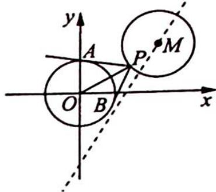

> [!faq]- 《高考数学培优40讲》例题解析
>
> > [!success]- **【答案】** 详见解析
>
> > [!note]- **【分析】**
> > 本题未单列分析。
>
> > [!note]- **【解析】**
> > 解析 由题意得圆心 $M(a, a - 4)$ 在直线 $x - y - 4 = 0$ 上运动, 所以动圆 $M$ 是圆心在直
> > 线 x-y-4=0 上, 半径为 1 的圆, 如图所示.
> > 又因为圆 $M$ 上存在点 $P$ , 使经过点 $P$ 作圆 $O$ 的两条切线, 使 $\angle APB = 60^\circ$ , 所以 $OP = 2$ , 即点 $P$ 在圆 $x^2 + y^2 = 4$ 上, 所以圆 $M$ 与圆 $x^2 + y^2 = 4$ 相交或相切, 于是 $2 - 1 \leqslant \sqrt{a^2 + (a - 4)^2} \leqslant 2 + 1$ , 即 $1 \leqslant \sqrt{a^2 + (a - 4)^2} \leqslant 3$ , 解得实数 $a$ 的取值范围是 $\left[2 - \frac{\sqrt{2}}{2}, 2 + \frac{\sqrt{2}}{2}\right]$ .
> > 
