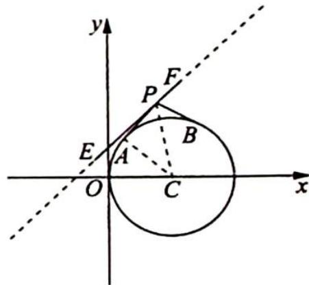
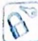

> [!faq]- 《高考数学培优40讲》例题解析
>
> > [!success]- **【答案】** 详见解析
>
> > [!note]- **【分析】**
> > 本题未单列分析。
>
> > [!note]- **【解析】**
> > 解析 由 $\overrightarrow{PA} \cdot \overrightarrow{PB} \leqslant 0$ 可知 $\angle APB \geqslant 90^{\circ}$ . 圆外一点与圆上两点所成角度最大的时候就是过圆外一点做圆的两条切线,两切点与圆外一点的夹角.
> > 如图所示,所以保证相切时的角度 $\angle APB \geqslant 90^{\circ}$ ,则 $\angle APC \geqslant 45^{\circ}$ ,则 $\frac{|CA|}{|PC|} \geqslant \frac{\sqrt{2}}{2}$ .
> > 又 $|CA|=2$ ，则 $|PC|\leqslant2\sqrt{2}$ ，由于圆的对称性，直线上有两个点到点C的距离为 $2\sqrt{2}$ ，而当这两个点就是E,F时， $|EF|$ 取最大值.
> > 
> > 由圆心 $C$ 到直线的距离 $d = \frac{|2 + 1 - 0|}{\sqrt{1^2 + (-1)^2}} = \frac{3\sqrt{2}}{2}$ ，则 $|EF|_{\max} = 2\sqrt{|PC|_{\max}^2 - d^2} = \sqrt{14}$ .
> > 故线段 EF 长度的最大值为 $\sqrt{14}$ .
> > 
