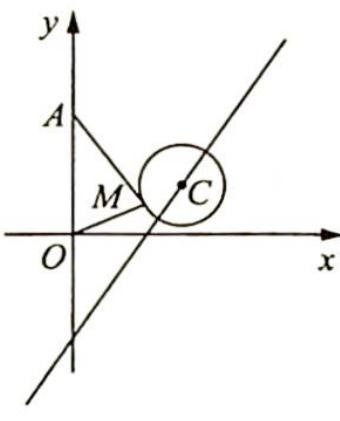

<!-- question-source:start -->
例 16.6 如图所示, 在平面直角坐标系 $xOy$ 中, 点 $A(0,3)$ , 直线 $l: y = 2x - 4$ . 设圆 $C$ 的半径为 1 , 圆心在 $l$ 上. 若圆 $C$ 上存在点 $M$ , 使 $MA = 2MO$ . 求圆心 $C$ 的横坐标 $a$ 的取值范围.

<!-- question-source:end -->

![[高中/总复习/专题/高考数学培优40讲/高考数学培优40讲-02-解析几何/第16讲_直线与圆的动态问题探究/显现隐圆_研究最值/16_4_模型三_阿波罗尼斯圆/例题/answers/Q00019502A1.md]]
