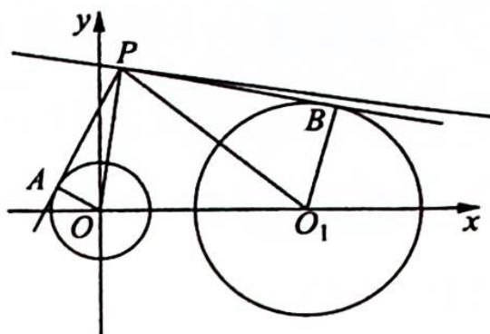

> [!faq]- 《高考数学培优40讲》例题解析
>
> > [!success]- **【答案】** 详见解析
>
> > [!note]- **【分析】**
> > 本题未单列分析。
>
> > [!note]- **【解析】**
> > 解析 ▶ 解法一(直译法): 设点 $P(x, y)$ , 在 $\triangle PAO$ 中, $|PA| = \sqrt{|OP|^2 - 1}$ , 在 $\triangle PBO_1$ 中, $|PB| = \sqrt{|O_1P|^2 - 4}$ .
> > 由 $|PB| = 2 |PA|$ ，可得 $\sqrt{|O_1P|^2 - 4} = 2\sqrt{|OP|^2 - 1}$ ，即 $\sqrt{(x - 4)^2 + y^2 - 4} = 2\sqrt{x^2 + y^2 - 1}$ ，整理得 $\left(x + \frac{4}{3}\right)^2 + y^2 = \frac{64}{9}$ .
> > 又点 $P$ 在直线 $x + \sqrt{3}y - b = 0$ 上运动,且满足题意的点 $P$ 有且只有两个,则直线 $x + \sqrt{3}y - b = 0$
> > 与圆 $\left(x+\frac{4}{3}\right)^{2}+y^{2}=\frac{64}{9}$ 相交，故圆心到直线的距离 $d=\frac{\left|-\frac{4}{3}-b\right|}{2}<r=\frac{8}{3}$ ，解得 $-\frac{20}{3}<b<4$ 。
> > 解法二(阿波罗尼斯圆):如图所示,由于 $PA, PB$ 为切线,则在 Rt $\triangle PAO$ 中, $|PO|^2 = |PA|^2 + 1$ ; 在 Rt $\triangle PBO_1$ 中, $|PO_1|^2 = |PB|^2 + 4$ .
> > 
> > 又 $|PB| = 2|PA|$ ，有 $|PB|^2 = 4|PA|^2$ ，则 $|PO_1|^2 = 4|PA|^2 + 4 = 4(|PA|^2 + 1) = 4|PO|^2$ ， $|PO_1| = 2|PO|$ .
> > 设点 $P(x, y)$ , 则 $\sqrt{(x - 4)^2 + y^2} = 2\sqrt{x^2 + y^2}$ , 整理得 $\left(x + \frac{4}{3}\right)^2 + y^2 = \frac{64}{9}$ .
> > 以下同解法一.
