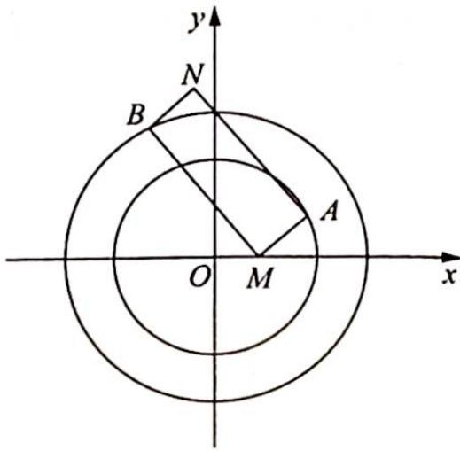

> [!faq]- 《高考数学培优40讲》例题解析
>
> > [!success]- **【答案】** 详见解析
>
> > [!note]- **【分析】**
> > 本题未单列分析。
>
> > [!note]- **【解析】**
> > 解析 如图所示, 以 $MA, MB$ 为邻边作矩形 $AMBN$ , 则 $AB = MN$ .
> > 
> > 由矩形的几何性质(矩形所在平面上的任意一点到其对角线上的两个定点的距离的平方和相等), 有 $OA^2 + OB^2 = OM^2 + ON^2$ , 代入数据得 $4 + 9 = 1 + ON^2$ , 解得 $|ON| = 2\sqrt{3}$ , 则点 $N$ 在以原点 $O$ 为圆心, 半径为 $2\sqrt{3}$ 的圆上, 圆的方程为 $x^2 + y^2 = 12$ .
> > 所以 $MN$ 的取值范围是 $[2\sqrt{3} - 1, 2\sqrt{3} + 1]$ . 故 $|AB|$ 的范围为 $[2\sqrt{3} - 1, 2\sqrt{3} + 1]$ .
