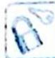

## 第16讲

## 直线与圆的动态问题探究

直线与圆作为解析几何的基础知识,在数形结合方面具有非常好的应用,也为我们研究圆锥曲线提供了支持.就直线与圆本身而言,动态关系问题的探究是相对较难的,高考也经常会涉及.动态的“动”体现在三种题型上,即动圆定直线、定圆动直线、动圆动直线.动态问题常常要进行动静之间的相互转化,而动与静的转化是过程与瞬间的转化.因此,深刻理解转化过程中的变与不变、动与静的关系,对分析问题和解决问题十分重要.因为只有这样才能真正理解消化,并举一反三、触类旁通.

直线与圆动态关系问题具体到考试中,往往会体现在定轨迹上的动点,或探寻动点运动轨迹求最值等两类问题。这时需根据几何特征先把“隐身的圆”显现出来,并使其参与到转化中。一般可转化为点到直线距离或直线与圆的位置关系,或是圆与圆的位置关系,但最终均和距离最值有关。

本讲结合例题阐述如何将抽象的量转化为可操作的量,及如何让隐形圆显现出来并参与问题的转化,希望通过本讲的研究读者可以掌握以静制动的策略,学会转化并发现问题的本质.

![[高中/总复习/专题/高考数学培优40讲/高考数学培优40讲-02-解析几何/第16讲_直线与圆的动态问题探究/16_1_动点在已知轨迹上求最值/16_1_动点在已知轨迹上求最值.md]]
![[高中/总复习/专题/高考数学培优40讲/高考数学培优40讲-02-解析几何/第16讲_直线与圆的动态问题探究/显现隐圆_研究最值/显现隐圆_研究最值.md]]
![[高中/总复习/专题/高考数学培优40讲/高考数学培优40讲-02-解析几何/第16讲_直线与圆的动态问题探究/训练_16/训练_16.md]]
