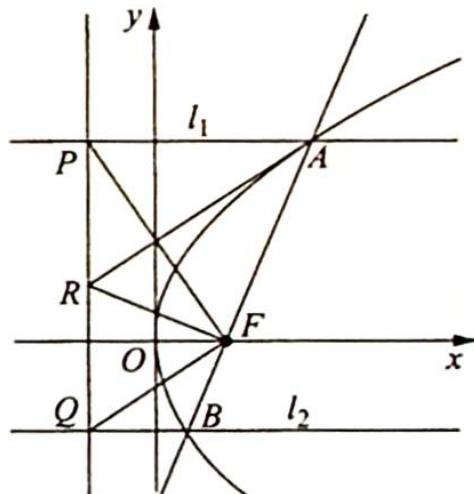
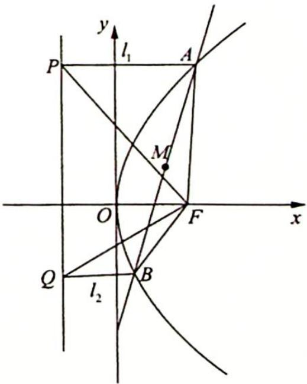

> [!faq]- 《高考数学培优40讲》例题解析
>
> > [!success]- **【答案】** 详见解析
>
> > [!note]- **【分析】**
> > 分析 (1) 证明 $AR \parallel FQ$ , 画图分析, 可以通过 $AR, FQ$ 都与 $PF$ 垂直来证明, 其中 $PF \perp FQ$ 可由角度来证明; $AR \perp PF$ 可通过中垂线定理来证明. (2) 将中点坐标用 $A, B$ 的坐标表示
> >
> > 出来,再消参得出中点横纵坐标间的关系.
>
> > [!note]- **【解析】**
> > 解析 (1)如图所示,连接 $PF, RF$ ,根据抛物线的定义可知 $AF = AP, BF = BQ$ ,所以 $\triangle PAF$ 和 $\triangle QBF$ 都是等腰三角形,则 $\angle AFP + \angle QFB = \frac{1}{2}(180^{\circ} - \angle PAF) + \frac{1}{2}(180^{\circ} - \angle QBF) = 180^{\circ} - \frac{1}{2} (\angle PAF + \angle QBF)$ .
> > 
> > 又因为 $l_{1} \parallel l_{2}$ ，所以 $\angle PAF + \angle QBF = 180^{\circ}$ ， $\angle AFP + \angle QFB = \frac{1}{2}$ $180^{\circ} - \frac{1}{2} \times 180^{\circ} = 90^{\circ}$ ，则 $PF \perp FQ$ 。因为点 R 是线段 PQ 的中点，所以 $FR = \frac{1}{2} PQ = PR$ ，直线
> > ${AR}$ 是线段 ${PF}$ 的垂直平分线, ${PF}\bot {AR}$ ,故 ${AR}//{FQ}$ .
> > (2)如图所示,设线段AB的中点为M,并且 $A\left(\frac{y_{1}^{2}}{2},y_{1}\right),B\left(\frac{y_{2}^{2}}{2},y_{2}\right)$ 则可得到 $P\left(-\frac{1}{2},y_{1}\right),Q\left(-\frac{1}{2},y_{2}\right),M(x_{0},y_{0})=\left(\frac{y_{1}^{2}+y_{2}^{2}}{4},\frac{y_{1}+y_{2}}{2}\right)$ .
> > 
> > 利用点斜式求得直线 $AB$ 的方程为 $\left(y - \frac{y_1 + y_2}{2}\right) = \frac{y_2 - y_1}{\frac{y_2^2}{2} - \frac{y_1^2}{2}}\left(x - \frac{y_1^2 + y_2^2}{4}\right)$ , 即 $(y_1 + y_2)\left(y - \frac{y_1 + y_2}{2}\right) = 2\left(x - \frac{y_1^2 + y_2^2}{4}\right)$ .
> > 令 $y = 0$ ，得 $-\frac{(y_1 + y_2)^2}{2} = 2x - \frac{y_1^2 + y_2^2}{2}, x = -\frac{y_1y_2}{2}$ ，所以直线 $AB$ 与 $x$ 轴交点的横坐标为 $-\frac{y_1y_2}{2}$
> > 根据 $\triangle PQF$ 的面积是 $\triangle ABF$ 的面积的两倍, 得 $\frac{1}{2} |y_1 - y_2| \times 1 = 2 \times \frac{1}{2} \left| -\frac{y_1y_2}{2} - \frac{1}{2} \right| \times |y_1 - y_2|$ , 化简得 $y_1y_2 = -2 (y_1y_2 = 0$ 舍去), 所以 $x_0 - y_0^2 = \frac{y_1^2 + y_2^2}{4} - \left(\frac{y_1 + y_2}{2}\right)^2 = -\frac{y_1y_2}{2} = 1$ , 即线段 $AB$ 中点的轨迹方程为 $y^2 = x - 1$ .
