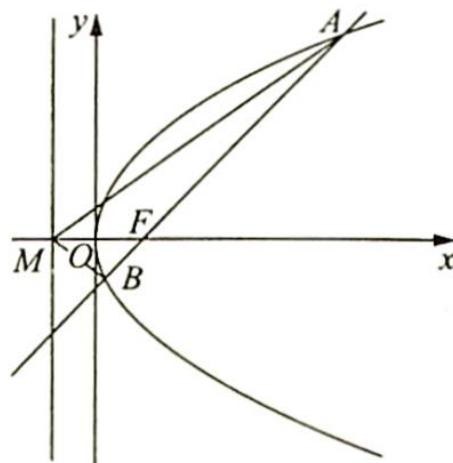
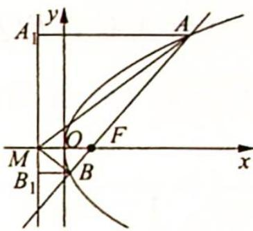

> [!faq]- 《高考数学培优40讲》例题解析
>
> > [!success]- **【答案】** 详见解析
>
> > [!note]- **【分析】**
> > 分析 利用两条直线之间的到角公式将 $\tan \angle AMB$ 用 $A, B$ 两点的坐标表示出来, 再用曲直联立、韦达定理得出 $\tan \angle AFx (AB$ 斜率) 与坐标间的关系. 这样就将待求的 $\angle AMB$ 的
> >
> > 正切值与已知角 $\angle OFA$ 联系起来了.
>
> > [!note]- **【解析】**
> > 解析 如图所示, 易知 $F(1,0), M(-1,0)$ , 不妨设直线 $AB$ 的倾斜角为 $\theta (0^{\circ} < \theta < 90^{\circ})$ , 则直线 $AB$ 的方程为 $y = \tan \theta (x - 1)$ .
> > 联立方程组 $\left\{\begin{aligned}y^{2}&=4x\\ y&=\tan\theta(x-1)\end{aligned}\right.$ ，得 $y^{2}\tan\theta-4y-4\tan\theta=0$ .
> > 
> > 设 $A(x_{1},y_{1}),B(x_{2},y_{2})$ ，则由一元二次方程的根与系数的关系得 $y_{1} + y_{2} = \frac{4}{\tan\theta},y_{1}y_{2} = -4$ ，所以 $x_{1} + x_{2} = \frac{y_{1}^{2}}{4} +\frac{y_{2}^{2}}{4} = \frac{(y_{1} + y_{2})^{2} - 2y_{1}y_{2}}{4} = \frac{4}{\tan^{2}\theta} +2,x_{1}x_{2} = \frac{y_{1}^{2}}{4}\cdot \frac{y_{2}^{2}}{4} = 1.$
> > 利用两条直线之间的到角公式可知 $\tan \angle AMB = \frac{k_{AM} - k_{BM}}{1 + k_{AM}k_{BM}} = \frac{\frac{y_1}{x_1 + 1} - \frac{y_2}{x_2 + 1}}{1 + \frac{y_1}{x_1 + 1} \cdot \frac{y_2}{x_2 + 1}} =$ $\frac{y_1x_2 + y_1 - y_2x_1 - y_2}{x_1x_2 + x_1 + x_2 + 1 + y_1y_2}.$
> > 因为 $y_{1}x_{2} + y_{1} - y_{2}x_{1} - y_{2} = \frac{y_{1}y_{2}^{2}}{4} +y_{1} - \frac{y_{2}y_{1}^{2}}{4} -y_{2} = \left(-\frac{y_{1}y_{2}}{4} +1\right)(y_{1} - y_{2}) = 2(y_{1} - y_{2}) =$ $2\sqrt{(y_1 + y_2)^2 - 4y_1y_2} = 8\sqrt{\frac{1}{\tan^2\theta} + 1}$ ，所以利用上面所得的式子化简 $\tan \angle AMB$ 的表达式可得 $\tan \angle AMB = \frac{8\sqrt{\frac{1}{\tan^2\theta} + 1}}{1 + \frac{4}{\tan^2\theta} + 2 + 1 - 4} = \frac{\frac{8}{\sin\theta}}{\frac{4\cos^2\theta}{\sin^2\theta}} = \frac{2\sin\theta}{\cos^2\theta}.$
> > 由题目中条件可知 $\theta = 50^{\circ}$ ，代入上式可得 $\tan \angle AMB = \frac{2\sin 50^{\circ}}{\cos^{2}50^{\circ}}.$
> > ## 评注
> > 一般地,有如下结论:已知抛物线 $C: y^{2} = 2px (p > 0)$ 的焦点为 $F$ , 抛物线 $C$ 的准线与 $x$ 轴交于点 $M$ , 倾斜角为 $\theta (0^{\circ} < \theta < 90^{\circ})$ 的直线 $l$ 交抛物线 $C$ 于 $A, B$ 两点, 则 $\angle AMB$ 为锐角且 $\tan \angle AMB = \frac{2\sin\theta}{\cos^2\theta}$ .
> > 此结论的证明除了可利用与上例同样的方法外,还可利用平面几何的方法:如图所示,过点 A 作 $AA_{1}$ 垂直于抛物线 C 的准线于点 $A_{1}$ , 过点 B 作 $BB_{1}$ 垂直于抛物线 C 的准线于点 $B_{1}$ , 根据抛物线的定义知 $AA_{1}=AF, BB_{1}=BF$ . 又因为 $AA_{1} \parallel MF \parallel BB_{1}$ , 所以 $\frac{A_{1}M}{B_{1}M}=$
> > 
> > $\frac{AF}{BF} = \frac{AA_1}{BB_1}$ , 则 $\triangle AA_1M \sim \triangle BB_1M, \angle A_1AM = \angle B_1BM, \angle AMF = \angle BMF$ , 因此 $\tan \frac{\angle AMB}{2} = \tan \angle MAA_1 = \frac{A_1M}{AA_1} = \frac{AF\sin\theta}{AF} = \sin\theta.$
> > $$
> > \tan \angle A M B = \frac {2 \tan \frac {\angle A M B}{2}}{1 - \tan^ {2} \frac {\angle A M B}{2}} = \frac {2 \sin \theta}{1 - \sin^ {2} \theta} = \frac {2 \sin \theta}{\cos^ {2} \theta}.
> > $$
> > ## 2. 圆锥曲线的几何形式的焦半径公式
> > ## 研究密钥
> > 妙用圆锥曲线的几何形式的焦半径公式:在极坐标系中,圆锥曲线有统一的极坐标方程 $\rho=\frac{ep}{1-e\cos\theta}$ , 极径 $\rho$ 事实上就是圆锥曲线的焦半径, 即其极坐标方程可以看成是圆锥曲线的统一的焦半径公式, 所以椭圆的几何形式的焦半径公式为 $\frac{\frac{c}{a}\left(\frac{a^{2}}{c}-c\right)}{1-\frac{c}{a}\cos\theta}=\frac{b^{2}}{a-c\cos\theta}$ ; 双曲线的几何形式的焦半径公式为 $\frac{\frac{c}{a}\left(c-\frac{a^{2}}{c}\right)}{1-\frac{c}{a}\cos\theta}=\frac{b^{2}}{a-c\cos\theta}$ ; 抛物线的几何形式的焦半径公式为 $\frac{ep}{1-e\cos\theta}=\frac{p}{1-\cos\theta}$ .
> > 圆锥曲线的几何形式的焦半径公式形式简单、应用灵活多变,因此在解题时要注意抓住本质,灵活应用.
