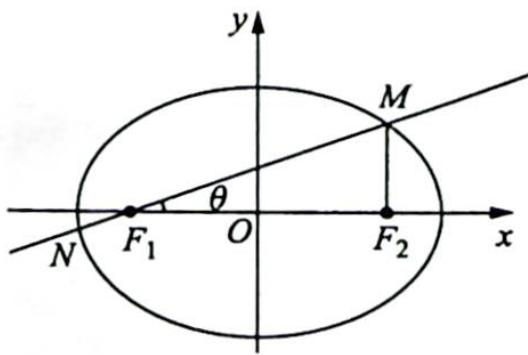

> [!faq]- 《高考数学培优40讲》例题解析
>
> > [!success]- **【答案】** 详见解析
>
> > [!note]- **【分析】**
> > 分析 (1)已知直线 $MN$ 的斜率求出 $\cos \theta$ , 代入几何形式的焦半径公式, 便可得离心率; (2)根据两个已知条件分别列两个方程, 直线 $MN$ 在 $y$ 轴上的截距为 2 , 即通径的一半为 4 ; 另一方面, $|MN| = 5 |F_1N|$ , 可得 $|MF_1| = 4 |F_1N|$ , 代入焦半径公式, 并用 $a, b$ 表示, 这样得出关于 $a, b$ 的方程组, 解方程组即可.
>
> > [!note]- **【解析】**
> > 解析 (1)如图所示, 设 $\angle MF_{1}F_{2}=\theta$ , 因为直线 $MN$ 的斜率为 $\frac{3}{4}$ , 即 $\tan\theta=\frac{3}{4}$ , 所以 $\sin\theta=\frac{|MF_{2}|}{|MF_{1}|}=\frac{3}{5}, \cos\theta=\frac{4}{5}$ . 根据椭圆的焦半径公式可得 $|MF_{2}|=\frac{ep}{1+ecos\frac{\pi}{2}}, |MF_{1}|=\frac{ep}{1-e\cos\theta}$ , 则 $\frac{|MF_{2}|}{|MF_{1}|}=$ $\frac{1 - e\cos\theta}{1 + e\cos\frac{\pi}{2}} = \frac{1 - \frac{4}{5}e}{1} = \frac{3}{5}$ , 解得椭圆的离心率 $e = \frac{1}{2}$ .
> > 
> > (2) 因为 $MF_{2} \parallel y$ 轴， $|F_{1}O| = |OF_{2}|$ ，且直线 MN 在 y 轴上的截距为 2，所以由三角形的中位线的性质可知 $|MF_{2}| = \frac{ep}{1 + e\cos\frac{\pi}{2}} = ep = \frac{b^{2}}{a} = 4$ ①.
> > 由题目中条件 $|MN| = 5|F_1N|$ ，可得 $|MF_1| = 4|F_1N|$ ，即 $\frac{ep}{1 - e\cos\theta} = \frac{4ep}{1 - e\cos(\theta + \pi)}$ ，解得 $e\cos \theta = \frac{3}{5}$ .
> > 又 $\cos\theta=\frac{F_{1}O}{\sqrt{F_{1}O^{2}+2^{2}}}=\frac{c}{\sqrt{c^{2}+4}}$ ，所以 $\frac{c}{a}\cdot\frac{c}{\sqrt{c^{2}+4}}=\frac{a^{2}-b^{2}}{a\sqrt{a^{2}-b^{2}+4}}=\frac{3}{5}$ ②，所以解①②组成的方程组可得 $a=7, b=2\sqrt{7}$ .
