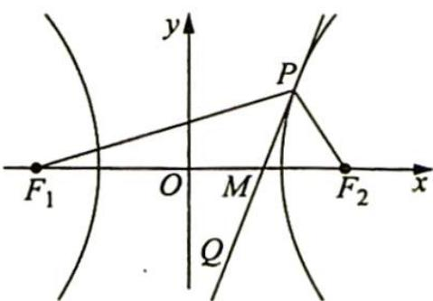

<!-- question-source:start -->
例 17.3 (2011 年北京大学自主招生考试) 如图所示, 点 $P$ 为双曲线 $\frac{x^{2}}{a^{2}} - \frac{y^{2}}{b^{2}} = 1 (a > 0, b > 0)$ 上任意的一点, 直线 $PQ$ 为双曲线在点 $P$ 处的切线, $F_{1}, F_{2}$ 为双曲线的焦点, 证明: $PQ$ 平分 $\angle F_{1}PF_{2}$ .

<!-- question-source:end -->

![[高中/总复习/专题/高考数学培优40讲/高考数学培优40讲-02-解析几何/第17讲_圆锥曲线的焦半径_焦点弦和焦点三角形问题/相关性质研究/17_2_焦半径公式的应用/例题/answers/Q00019514A1.md]]
