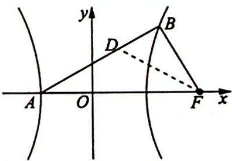

> [!faq]- 《高考数学培优40讲》例题解析
>
> > [!success]- **【答案】** 详见解析
>
> > [!note]- **【分析】**
> > 分析 ▶ 思路一: 要证 $\angle BFA = 2\angle BAF$ , 作 $\angle BFA$ 的平分线交 $AB$ 于点 $D$ , 只要证明点 $D$ 在线段 $AF$ 的垂直平分线上即可; 思路二: 利用双曲线的参数方程, 将对 $\angle BFA = 2\angle BAF$ 的证明转化为 $\tan \angle BFA = \tan 2\angle BAF$ , 再转化为三角恒等式的证明.
>
> > [!note]- **【解析】**
> > 解析 (1) 当 $BF \perp AF$ 时, $|AF| = a + c$ , $|BF| =$ 通径长的一半 $= \frac{b^2}{a}$ , 所以 $a + c = \frac{b^2}{a}$ , 即 $a + c = \frac{c^2 - a^2}{a}, c^2 - ca - 2a^2 = 0, \left(\frac{c}{a}\right)^2 - \frac{c}{a} - 2 = 0$ , 解得双曲线 $C$ 的离心率 $e = \frac{c}{a} = 2$ .
> > (2)证法一:如图所示,设 $B(x_{0},y_{0})$ ,作 $\angle BFA$ 的平分线交 $AB$ 于点 $D$ .
> > 因为 $\frac{|BF|}{x_0 - \frac{a^2}{c}} = \frac{c}{a}$ , 所以 $|BF| = \frac{c}{a} x_0 - a$ , 根据角平分线的性质, 可得 $\frac{|BF|}{|AF|} = \frac{|BD|}{|AD|}$ , 即 $\frac{\frac{c}{a} x_0 - a}{a + c} = \frac{x_0 - x_D}{x_D + a}, \left(\frac{c}{a} x_0 - a\right) x_D + cx_0 - a^2 =$
> > 
> > $(-a - c)x_{D} + (a + c)x_{0}$ , 解得 $x_{D} = \frac{ax_{0} + a^{2}}{\frac{c}{a}x_{0} + c}$ , 由(1)可得 $c = 2a$ , 代入可得 $x_{D} = \frac{ax_{0} + a^{2}}{2x_{0} + 2a} = \frac{a}{2} = \frac{c + (-a)}{2}$ , 即点 $D$ 在 $AF$ 的垂直平分线上, 所以 $\frac{1}{2}\angle BFA = \angle DFA = \angle BAF$ , 故 $\angle BFA = 2\angle BAF$ .
> > 证法二:由(1)可得 c=2a, 则 $b=\sqrt{c^{2}-a^{2}}=\sqrt{3}a$ , 所以双曲线的方程为 $\frac{x^{2}}{a^{2}}-\frac{y^{2}}{3a^{2}}=1$ . 设 $B(a\sec\alpha,\sqrt{3}a\tan\alpha)$ , 其中 $\alpha\in\left(0,\frac{\pi}{2}\right)$ .
> > 当 $\alpha = \frac{\pi}{3}$ 时，点 $B$ 的坐标为 $(2a,3a)$ ，此时 $\left\{ \begin{array}{l} \angle BFA = \frac{\pi}{2} \\ \angle BAF = \frac{\pi}{4} \end{array} \right.$ ，所以 $\angle BFA = 2\angle BAF$ 显然成立。当 $\alpha \neq \frac{\pi}{3}$ 时， $\left\{ \begin{array}{l} \tan \angle BFA = -k_{BF} = -\frac{\sqrt{3} a \tan \alpha}{a \sec \alpha - 2a} = \frac{\sqrt{3} \sin \alpha}{2 \cos \alpha - 1} \\ \tan \angle BAF = k_{AB} = \frac{\sqrt{3} a \tan \alpha}{a \sec \alpha + a} = \frac{\sqrt{3} \sin \alpha}{\cos \alpha + 1} \end{array} \right.$ ，所以 $\tan 2\angle BAF = \frac{2\tan\angle BAF}{1 - \tan^2\angle BAF} = \frac{2\times\frac{\sqrt{3}\sin\alpha}{\cos\alpha + 1}}{1 - \left(\frac{\sqrt{3}\sin\alpha}{\cos\alpha + 1}\right)^2} = \frac{2\times\frac{\sqrt{3}\sin\alpha}{\cos\alpha + 1}}{1 - \frac{3(1 - \cos\alpha)(1 + \cos\alpha)}{(\cos\alpha + 1)^2}} = \frac{\sqrt{3}\sin\alpha}{2\cos\alpha - 1}$ ，则 $\tan \angle BFA = \tan 2\angle BAF, \angle BFA = 2\angle BAF.$
> > 综上可得, $\angle {BFA} = 2\angle {BAF}$ 恒成立.
