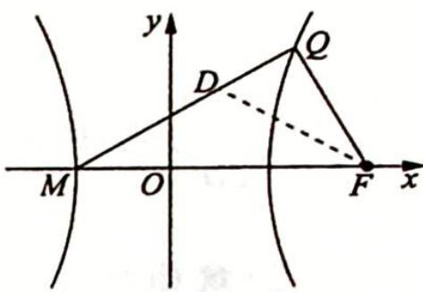

> [!faq]- 《高考数学培优40讲》例题解析
>
> > [!success]- **【答案】** 详见解析
>
> > [!note]- **【分析】**
> > 本题未单列分析。
>
> > [!note]- **【解析】**
> > 解析 ▶ (1)由双曲线离心率为 2 知 $c=2a, b=\sqrt{3}a$ ，于是双曲线方程可化为 $\frac{x^2}{a^2}-\frac{y^2}{3a^2}=1$ 。又直线 $l: y=x+m$ ，与双曲线方程联立得 $2x^2-2mx-m^2-3a^2=0$ ①，设点 $A(x_1, y_1)$ ， $B(x_2, y_2)$ ，则 $x_1+x_2=m, x_1x_2=\frac{-m^2-3a^2}{2}$ ②。因为 $\overrightarrow{AP}=3\overrightarrow{PB}$ ，所以 $(-x_1, m-y_1)=3(x_2, y_2-m)$ ，故 $x_1=-3x_2$ 。结合 $x_1+x_2=m$ ，解得 $x_1=\frac{3}{2}m, x_2=-\frac{1}{2}m$ ，代入式②得 $-\frac{3}{4}m^2=\frac{-m^2-3a^2}{2}\Rightarrow m^2=6a^2$ 。又 $\overrightarrow{OA} \cdot \overrightarrow{OB}=x_1x_2+y_1y_2=x_1x_2+(x_1+m)(x_2+m)=2x_1x_2+m(x_1+x_2)+m^2=m^2-3a^2=3a^2=3$ ，从而 $a^2=1$ 。此时 $m=\sqrt{6}$ 或 $m=-\sqrt{6}$ （舍去），代入式①并整理得 $2x^2-2\sqrt{6}x-9=0$ 。显然，该方程有两个不同的实根，因此， $a^2=1$ 符合要求。故双曲线 C 的方程为 $x^2-\frac{y^2}{3}=1$ 。
> > (2)解法一:找特殊情况确定点 M 的位置. 令 $QF \perp MF$ , 此时 $\angle QFM = 2\angle QMF = 90^{\circ}$ , 则 $\angle QMF = 45^{\circ}$ , $\triangle QFM$ 是一个等腰直角三角形. 又 $QF = \frac{b^{2}}{a} = 3$ , 所以 MF = 3, 故点 M 的坐标为
> > $M(-1,0)$ .
> > 下面证明 M 在一般情况下也成立,使得 $\angle QFM = 2\angle QMF$ .
> > 如图所示,作∠QFM的平分线交QM于点D,因为 $\frac{|QF|}{x_{0}-\frac{a^{2}}{c}}=\frac{c}{a}$ ,所以 $|QF|=\frac{c}{a}x_{0}-a$ ,根据角平分线的性质,可得 $\frac{|QF|}{|MF|}=\frac{|QD|}{|MD|}$ ,即 $\frac{\frac{c}{a}x_{0}-a}{a+c}=$
> > 
> > $\frac{x_0 - x_D}{x_D + a}$ , 解得 $x_D = \frac{ax_0 + a^2}{\frac{c}{a}x_0 + c}$ , 由(1)可得 $e = 2, c = 2a$ , 代入上式得 $x_D = \frac{a}{2} = \frac{c + (-a)}{2}$ , 即点 $D$ 在 $MF$ 的垂直平分线上, 所以 $\frac{1}{2}\angle QFM = \angle DFM = \angle QMF$ , 故 $\angle QFM = 2\angle QMF$ , 此时 $M$ 的坐标为 $(-1,0)$ .
> > 综上所述,存在定点 $M(-1,0)$ 满足 $\angle QFM = 2\angle QMF$ .
> > 解法二: 假设点 $M(t,0)$ 存在. 由(1)知双曲线右焦点为 $F(2,0)$ .
> > 设 $Q(x_0, y_0)(x_0 \geqslant 1)$ 为双曲线 $C$ 右支上一点，当 $x_0 \neq 2$ 时， $\tan \angle QFM = -k_{QF} = -\frac{y_0}{x_0 - 2}$ ， $\tan \angle QMF = k_{QM} = \frac{y_0}{x_0 - t}$ .
> > 因为 $\angle QFM = 2\angle QMF$ ，所以 $-\frac{y_0}{x_0 - 2} = \frac{\frac{2y_0}{x_0 - t}}{1 - \left(\frac{y_0}{x_0 - t}\right)^2}, -\frac{1}{x_0 - 2} = \frac{2(x_0 - t)}{(x_0 - t)^2 - y_0^2}$ 将 $y_0^2 = 3x_0^2 -3$ 代入上式整理得 $(4 + 2t)x_0 - 4t = -2tx_0 + t^2 +3\Rightarrow \left\{ \begin{array}{ll}4 + 2t = -2t\\ -4t = t^2 +3 \end{array} \right.\Rightarrow t = -1.$
> > 当 $x_{0}=2$ 时， $\angle QFM=90^{\circ}$ ，而 t=-1 时， $\angle QMF=45^{\circ}$ ，符合 $\angle QFM=2\angle QMF$ 。
> > 所以满足条件的点 $M(-1,0)$ 存在.
