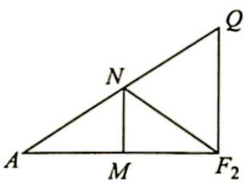

> [!faq]- 《高考数学培优40讲》例题解析
>
> > [!success]- **【答案】** 详见解析
>
> > [!note]- **【分析】**
> > 本题未单列分析。
>
> > [!note]- **【解析】**
> > 解析 (1) 设 $|PF_1| = m, |PF_2| = n, F_2 (c,0)$ ，则 $\left\{ \begin{array}{l} m - n = 2a \\ \frac{1}{2}\sin \frac{\pi}{3} \cdot mn = 3\sqrt{3} a^2 \end{array} \right.$ ，即 $\left\{ \begin{array}{l} m - n = 2a \\ mn = 12a^2 \end{array} \right.$ . 根据余弦定理得 $(2c)^2 = |F_1F_2|^2 = m^2 + n^2 - mn = 16a^2$ ，于是 $e = \frac{c}{a} = 2$ .
> > (2) 双曲线方程为 $\frac{x^2}{a^2} - \frac{y^2}{3a^2} = 1$ ，即 $y^2 = 3(x^2 - a^2)$ .
> > 显然 $(c,3a)$ 是双曲线上一点,此时 $\lambda=2$ ,于是若 $\lambda$ 存在,则其值只可能为2.
> > 如图所示, 设 $Q(x_0, y_0)$ , $MN$ 为 $AF_2$ 的垂直平分线, 则 $A(-a, 0)$ , $F_2(2a, 0), M\left(\frac{1}{2}a, 0\right)$ , 于是 $\frac{|AN|}{|NQ|} = \frac{x_N - x_A}{x_Q - x_N} = \frac{\frac{3}{2}a}{x_0 - \frac{1}{2}a} = \frac{3a}{2x_0 - a} = \frac{|AF_2|}{|QF_2|}$ , 其中最后一个等号是因为 $|AF_2| = 3a$ , $|QF_2| = ex_0 - a = 2x_0 - a$ .
> > 
> > 又 $\frac{|AN|}{|NQ|}=\frac{|AF_{2}|}{|QF_{2}|}$ ，所以 $|NF_{2}|$ 为 $\angle QF_{2}A$ 的平分线，因此 $\angle QF_{2}A=2\angle NF_{2}A=2\angle QAF_{2}$ ，故 $\lambda$ 的值为2.
