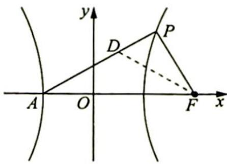

> [!faq]- 《高考数学培优40讲》例题解析
>
> > [!success]- **【答案】** 详见解析
>
> > [!note]- **【分析】**
> > 本题未单列分析。
>
> > [!note]- **【解析】**
> > 解析 (1)由 $|a| - |b| = 2$ 得 $\sqrt{(x + 2)^2 + y^2} -\sqrt{(x - 2)^2 + y^2} = 2$ ，故点 $P$ 的轨迹方程为 $x^{2} - \frac{y^{2}}{3} = 1(x > 0)$
> > (2)在第一象限内作 $PF \perp x$ 轴, 则 $P(2,3)$ , 此时 $\angle PFA = 90^{\circ}, \angle PAF = 45^{\circ}$ , 即 $\lambda = 2$ . 下面证明 $PF$ 不与 $x$ 轴垂直时, $\angle PFA = 2\angle PAF$ 也成立.
> > 如图所示, 设 $P(x_0, y_0)$ , 作 $\angle PFA$ 的平分线交 $AP$ 于点 $D$ .
> > 因为 $\frac{|PF|}{x_0 - \frac{a^2}{c}} = \frac{c}{a}$ , 所以 $|PF| = \frac{c}{a} x_0 - a$ , 根据角平分线的性质可得 $\frac{|PF|}{|AF|} = \frac{|PD|}{|AD|}$ , 即 $\frac{\frac{c}{a} x_0 - a}{a + c} = \frac{x_0 - x_D}{x_D + a}$ , 解得 $x_D = \frac{ax_0 + a^2}{\frac{c}{a} x_0 + c}$ .
> > 
> > 由(1)可得 c=2a，代入上式得 $x_{D}=\frac{a}{2}=\frac{c+(-a)}{2}$ ，即点 D 在 AF 的垂直平分线上，所以 $\frac{1}{2}\angle PFA=\angle DFA=\angle PAF,\angle PFA=2\angle PAF.$
> > 由对称性知, 当点 $P$ 在第四象限时, 结论同样成立, 因此存在常数 $\lambda = 2$ , 使得 $\angle PFA = 2\angle PAF$ 恒成立.
