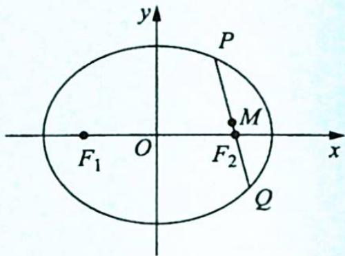
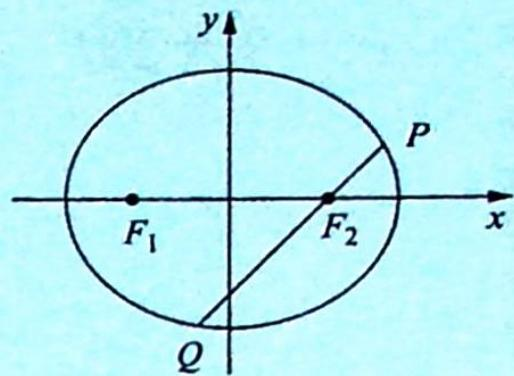

> [!faq]- 《高考数学培优40讲》例题解析
>
> > [!success]- **【答案】** D
>
> > [!note]- **【分析】**
> > 分析 ▶ 根据中垂线定理, 存在点 P 满足线段 AP 的垂直平分线过点 $F_{2}$ 可转化为在椭圆上存在点 P 使得 $\left|PF_{2}\right|=\left|AF_{2}\right|$ , 而 $\left|AF_{2}\right|=\frac{a^{2}}{c}-c,\left|PF_{2}\right|$ 的取值范围是 $[a-c,a+c]$ , 即$\frac{a^2}{c} - c$ 在 $[a - c, a + c]$ 区间上，由此得离心率的取值范围.
>
> > [!note]- **【解析】**
> > 解析 ▶ 易求得 $\left|AF_{2}\right|=\frac{a^{2}}{c}-c=\frac{b^{2}}{c}$ ，在椭圆上存在点 P 满足线段 AP 的垂直平分线过点 $F_{2}$ 的充要条件是在椭圆上存在点 P 使得 $\left|PF_{2}\right|=\left|AF_{2}\right|=\frac{b^{2}}{c}$ 。因为 $\left|PF_{2}\right|$ 的取值范围是 $[a-c,a+c]$ ，且 $\frac{b^{2}}{c}>a-c$ ，所以只需 $\frac{b^{2}}{c}\leqslant a+c$ ，即 $\frac{a^{2}-c^{2}}{c}\leqslant a+c$ ，解得 $e=\frac{c}{a}\geqslant\frac{1}{2}$ 。又因为 $e=\frac{c}{a}<1$ ，故选 D。
> > ## 2. 焦点弦的性质
> > 研究密钥
> > 性质2: 已知椭圆的方程为 $\frac{x^{2}}{a^{2}} + \frac{y^{2}}{b^{2}} = 1 (a > b > 0)$ , 则过椭圆的焦点的所有弦中, 通径最
> > $$
> > \frac {2 b ^ {2}}{a}
> > $$
> > 【证法一】如图所示，设 $PQ$ 是过椭圆的右焦点 $F_{2}$ 的弦且 $P(x_{1},y_{1}), Q(x_{2},y_{2})$ ，点 $M(x_{M},y_{M})$ 是线段 $PQ$ 的中点，则由代数形式的焦半径公式得 $\left|PF_{2}\right| = a - ex_{1},\left|QF_{2}\right| = a - ex_{2}$ ，所以 $\left|PQ\right| =$ $\left|PF_2\right| + \left|QF_2\right| = 2a - e(x_1 + x_2) = 2a - 2ex_M.$
> > 
> > 当 $PQ$ 垂直于 $x$ 轴时, 点 $M$ 的坐标为 $(c,0)$ , 所以 $|PQ| = 2a - 2ec = \frac{2a^2 - 2c^2}{a} = \frac{2b^2}{a}$ ; 当 $PQ$ 不垂直于 $x$ 轴时, 不妨设 $|PF_2| > |QF_2|$ , 则点 $M$ 在线段 $|PF_2|$ 上, 且点 $M$ 的横坐标小于 $c$ , 所以 $|PQ| = 2a - 2ex_M > 2a - 2ec = \frac{2a^2 - 2c^2}{a} = \frac{2b^2}{a}$ .
> > 综上可得,过椭圆的焦点的所有弦中,通径最短,其长度为 $\frac{2b^{2}}{a}$ .
> > 【证法二】设 $\angle PF_{2}x = \alpha$ ，由几何形式的焦半径公式得 $|PF_{2}| = \frac{b^{2}}{a + c\cos\alpha}$ ， $|QF_{2}| = \frac{b^{2}}{a + c\cos(\pi + \alpha)} = \frac{b^{2}}{a - c\cos\alpha}$ ，所以 $|PQ| = |PF_{2}| + |QF_{2}| = \frac{b^{2}}{a + c\cos\alpha} + \frac{b^{2}}{a - c\cos\alpha} = \frac{2ab^{2}}{a^{2} - c^{2}\cos^{2}\alpha} \geqslant \frac{2ab^{2}}{a^{2}} = \frac{2b^{2}}{a}$ ，当且仅当 $\cos^2\alpha = 0$ ，即 $PQ$ 垂直于 $x$ 轴时等号成立，所以过椭圆的焦点的所有弦中，通径最短，其长度为 $\frac{2b^{2}}{a}$ .
> > 由此可得如下推论.
> > 推论: 已知椭圆的方程为 $\frac{x^{2}}{a^{2}} + \frac{y^{2}}{b^{2}} = 1 (a > b > 0)$ ，设过椭圆的焦点的弦与 x 轴正半轴的夹
> > 角为 $\alpha$ ，则此焦点弦长为 $\frac{2ab^{2}}{a^{2}-c^{2}\cos^{2}\alpha}$ .
> > 性质3:如图所示,已知 $PQ$ 是过椭圆 $\frac{x^2}{a^2} + \frac{y^2}{b^2} = 1 (a > b > 0)$ 的右焦点 $F_2$ 的弦,则 $\frac{1}{|PF_2|} + \frac{1}{|QF_2|} = \frac{2a}{b^2}$ ,即椭圆的焦点弦被相应的焦点分成的两条线段长的倒数和等于通径长的倒数的4倍.
> > 
> > 【证明】根据椭圆的焦半径公式得 $\left|PF_{2}\right|=\frac{b^{2}}{a+c\cos\beta},\left|QF_{2}\right|=\frac{b^{2}}{a+c\cos(\beta+\pi)}=\frac{b^{2}}{a-c\cos\beta}$ ，
> > 所以 $\frac{1}{\left|PF_{2}\right|}+\frac{1}{\left|QF_{2}\right|}=\frac{a+c\cos\beta}{b^{2}}+\frac{a-c\cos\beta}{b^{2}}=\frac{2a}{b^{2}}.$
> > 【注】事实上, 利用圆锥曲线的统一的极坐标方程得 $\frac{1}{|PF|} + \frac{1}{|QF|} = \frac{1 - e\cos\theta}{ep} + \frac{1 - e\cos(\theta + \pi)}{ep} = \frac{1 - e\cos\theta}{ep} + \frac{1 + e\cos\theta}{ep} = \frac{2}{ep}$ . 当圆锥曲线为椭圆或双曲线时, $\frac{1}{|PF|} + \frac{1}{|QF|} = \frac{2a}{b^2}$ ; 当圆锥曲线为抛物线时, $\frac{1}{|PF|} + \frac{1}{|QF|} = \frac{2}{p}$ .
