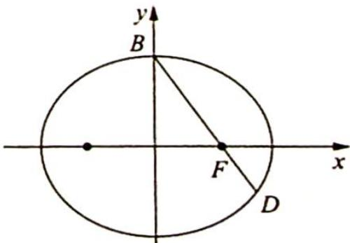

> [!faq]- 《高考数学培优40讲》例题解析
>
> > [!success]- **【答案】** 详见解析
>
> > [!note]- **【分析】**
> > 分析 ▶ 根据焦点弦的性质3有 $\frac{1}{|BF|} + \frac{1}{|FD|} = \frac{2a}{b^2}$ , 将 $|BF|$ , $|FD|$ 用基本量表示出来, 则离心率可求. 由于条件 $\overrightarrow{BF} = 2\overrightarrow{FD}$ 告诉了 $|BF|$ , $|FD|$ 的关系, 所以只将 $|FD|$ 用基本量表示出来即可.
>
> > [!note]- **【解析】**
> > 解析 如图所示, 设椭圆 C 的方程为 $\frac{x^{2}}{a^{2}} + \frac{y^{2}}{b^{2}} = 1 (a > b > 0)$ , 点 B(0, b) 为椭圆的上顶点, 点 F(c, 0) 为椭圆的右焦点, 所以 $|BF| =$ $\sqrt{(0 - c)^2 + (b - 0)^2} = a$ ，根据 $\overrightarrow{BF} = 2\overrightarrow{FD}$ ，可得 $|FD| = \frac{1}{2}|BF| = \frac{1}{2} a.$
> > 
> > 根据性质3得 $\frac{1}{|BF|} +\frac{1}{|FD|} = \frac{2a}{b^2}$ 所以 $\frac{1}{a} +\frac{2}{a} = \frac{2a}{b^2}$ 即 $2a^{2} = 3b^{2}$ ，将 $b^{2} = a^{2} - c^{2}$ 代入上式得 $a^2 = 3c^2$ ，解得 $e = \frac{c}{a} = \frac{\sqrt{3}}{3}$
