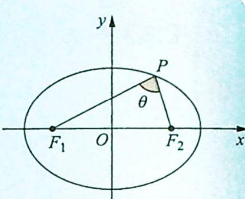
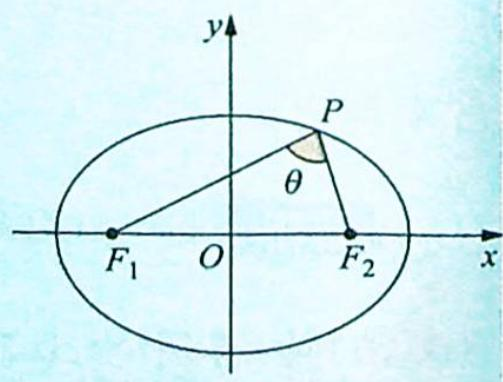
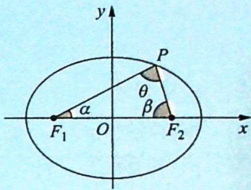
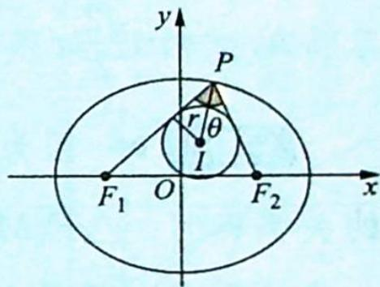

## 17.4 焦点三角形的性质

## 研究密钥

性质1(椭圆焦点三角形的周长与面积):如图所示,已知椭圆的方程为 $\frac{x^{2}}{a^{2}}+\frac{y^{2}}{b^{2}}=1(a>b>0)$ ,左、右两焦点分别为 $F_{1},F_{2},\triangle PF_{1}F_{2}$ 为焦点三角形,设 $\angle F_{1}PF_{2}=\theta(0^{\circ}<\theta<180^{\circ})$ ,则 $C_{\triangle PF_{1}F_{2}}=2(a+c),S_{\triangle PF_{1}F_{2}}=b^{2}\tan\frac{\theta}{2}.$

【证明】根据椭圆的定义及余弦定理可知 $\left\{\begin{array}{l}|PF_{1}|+|PF_{2}|=2a \quad ①\\ |PF_{1}|^{2}+|PF_{2}|^{2}-2|PF_{1}||PF_{2}|\cos\theta=4c^{2}\quad ②\end{array}\right.$ ① $^{2}$ −②得 $2|PF_{1}||PF_{2}|(1+\cos\theta)=4b^{2}$ , 所以 $|PF_{1}||PF_{2}|=\frac{2b^{2}}{1+\cos\theta}$ , 则 $C_{\triangle PF_{1}F_{2}}=|PF_{1}|+$ $|PF_{2}|+|F_{1}F_{2}|=2(a+c)$ , $S_{\triangle PF_{1}F_{2}}=\frac{1}{2}|PF_{1}||PF_{2}|\sin\theta=\frac{1}{2}\times\frac{2b^{2}}{1+\cos\theta}\cdot\sin\theta=b^{2}\cdot$ $\frac{2\sin\frac{\theta}{2}\cos\frac{\theta}{2}}{2\cos^{2}\frac{\theta}{2}}=b^{2}\tan\frac{\theta}{2}.$

推论1(双曲线焦点三角形的周长与面积): 已知双曲线的方程为 $\frac{x^2}{a^2} - \frac{y^2}{b^2} = 1 (a > 0, b > 0)$ , 左、右两焦点分别为 $F_1, F_2$ , $\triangle PF_1F_2$ 为焦点三角形, 设 $\angle F_1PF_2 = \theta (0^\circ < \theta < 180^\circ)$ , 则 $S_{\triangle PF_1F_2} = \frac{b^2}{\tan \frac{\theta}{2}} = b^2 \cot \frac{\theta}{2}$ .

性质2(焦点三角形的张角):如图所示,已知椭圆的方程为 $\frac{x^{2}}{a^{2}}+\frac{y^{2}}{b^{2}}=1(a>b>0)$ ,左、右两焦点分别为 $F_{1},F_{2},\triangle PF_{1}F_{2}$ 是焦点三角形,设 $\angle F_{1}PF_{2}=\theta(0^{\circ}<\theta<180^{\circ})$ ,则 $\cos\theta\geqslant1-2e^{2}$ ,当且仅当点P为椭圆短轴的端点时, $\cos\theta$ 取得最小值,即 $\angle F_{1}PF_{2}$ 取得最大值.

【证明】设 $\angle F_{1}PF_{2} = \theta (0^{\circ} < \theta < 180^{\circ})$ ，由椭圆的性质及余弦定理知 $\cos \theta = \frac{|PF_1|^2 + |PF_2|^2 - 4c^2}{2|PF_1||PF_2|} = \frac{(|PF_1| + |PF_2|)^2 - 2|PF_1||PF_2| - 4c^2}{2|PF_1||PF_2|} = \frac{2b^2}{|PF_1||PF_2|} - 1 \geqslant \frac{2b^2}{\left(\frac{|PF_1| + |PF_2|}{2}\right)^2} - 1 = \frac{2b^2}{a^2} - 1 = 1 - 2e^2$ ，当且仅当 $|PF_1| = |PF_2|$ 时等号成立，此时点 $P$ 为椭圆短轴的端点， $\cos \theta$ 取得最小值， $\angle F_{1}PF_{2}$ 取得最大值。

性质3(椭圆焦点三角形的角度与离心率):如图所示,已知椭圆的方程为 $\frac{x^{2}}{a^{2}}+\frac{y^{2}}{b^{2}}=1(a>b>0)$ ，左、右两焦点分别为 $F_{1},F_{2},\triangle PF_{1}F_{2}$ 为焦点三角形，设 $\angle F_{1}PF_{2}=\theta,\angle PF_{1}F_{2}=\alpha,\angle PF_{2}F_{1}=\beta$ ，则椭圆的离心率为 $e=\frac{\sin(\alpha+\beta)}{\sin\alpha+\sin\beta}$ .

【证明】由椭圆的离心率的定义及正弦定理知

$$
e = \frac {c}{a} = \frac {2 c}{2 a} = \frac {\left| F _ {1} F _ {2} \right|}{\left| P F _ {1} \right| + \left| P F _ {2} \right|} = \frac {1}{\frac {\left| P F _ {1} \right|}{\left| F _ {1} F _ {2} \right|} + \frac {\left| P F _ {2} \right|}{\left| F _ {1} F _ {2} \right|}} = \frac {1}{\frac {\sin \beta}{\sin \theta} + \frac {\sin \alpha}{\sin \theta}} = \frac {\sin \theta}{\sin \alpha + \sin \beta} = \frac {\sin (\alpha + \beta)}{\sin \alpha + \sin \beta}.
$$

性质4(椭圆焦点三角形内切圆性质):如图所示,已知椭圆的方程为 $\frac{x^{2}}{a^{2}}+\frac{y^{2}}{b^{2}}=1(a>b>0)$ ，左、右两焦点分别为 $F_{1},F_{2},\triangle PF_{1}F_{2}$ 为焦点三角形，点I是 $\triangle PF_{1}F_{2}$ 的内心，若 $\angle F_{1}PF_{2}=\theta$ ，则 $|PI|\cos\frac{\theta}{2}=a-c$ .

【证明】设焦点三角形 $PF_{1}F_{2}$ 的内切圆的半径为 r，则 $S_{\triangle PF_{1}F_{2}} = \frac{1}{2} (|PF_{1}| + |PF_{2}| + |F_{1}F_{2}|)r = (a+c)r$ 。又由上面性质 1 可知 $S_{\triangle PF_{1}F_{2}} = b^{2}\tan\frac{\theta}{2}$ ，所以 $(a+c)r = b^{2}\tan\frac{\theta}{2}$ 。将 $r = |PI| \sin\frac{\theta}{2}$ 代入上式化简得 $(a+c)|PI| \cos\frac{\theta}{2} = b^{2}$ ，即 $(a+c) \cdot |PI| \cos\frac{\theta}{2} = a^{2} - c^{2}$ ， $|PI| \cos\frac{\theta}{2} = a - c$ ，原命题得证。

推论 2(椭圆焦点三角形内切圆性质): 已知椭圆的方程为 $\frac{x^{2}}{a^{2}} + \frac{y^{2}}{b^{2}} = 1 (a > b > 0)$ , 左、右两焦点分别为 $F_{1}, F_{2}, \triangle PF_{1}F_{2}$ 为焦点三角形, 点 $I$ 是 $\triangle PF_{1}F_{2}$ 的内心, 则 $\frac{|PI|^{2}}{|PF_{1}| \cdot |PF_{2}|} = \frac{1 - e}{1 + e}$ .

【证明】设 $\angle F_{1}PF_{2}=\theta$ ，且 $\triangle PF_{1}F_{2}$ 的内切圆半径为 $r$ ，由上面焦点三角形面积公式可知

$S_{\triangle PF_1F_2}=b^2\tan\frac{\theta}{2}$ . 因为 $S_{\triangle PF_1F_2}=\frac{1}{2}|PF_1||PF_2|\sin\theta$ ，所以 $b^2\tan\frac{\theta}{2}=\frac{1}{2}|PF_1||PF_2|\sin\theta$ ，即 $b^{2}\tan\frac{\theta}{2}=|PF_{1}||PF_{2}|\sin\frac{\theta}{2}\cos\frac{\theta}{2},\cos^{2}\frac{\theta}{2}=\frac{b^{2}}{|PF_{1}||PF_{2}|}.$ 又 $S_{\triangle PF_{1}F_{2}}=\frac{1}{2}\left(|PF_{1}|+|PF_{2}|+|F_{1}F_{2}|\right)r=(a+c)r$ ，所以 $(a+c)r=\frac{1}{2}|PF_{1}|$ $|PF_{2}|\sin\theta$ , 将 $r=|PI|\sin\frac{\theta}{2}$ 代入上面式子得 $(a+c)|PI|\sin\frac{\theta}{2}=|PF_{1}||PF_{2}|\sin\frac{\theta}{2}\cos\frac{\theta}{2}$ ，即 $(a+c)|PI|=|PF_{1}||PF_{2}|\cos\frac{\theta}{2},(a+c)^{2}|PI|^{2}=|PF_{1}|^{2}|PF_{2}|^{2}\cos^{2}\frac{\theta}{2}.$ 将 $\cos^{2}\frac{\theta}{2}=\frac{b^{2}}{|PF_{1}||PF_{2}|}$ 代入上式化简得 $(a+c)^{2}|PI|^{2}=|PF_{1}||PF_{2}|b^{2}$ ，即 $\frac{|PI|^2}{|PF_1||PF_2|}=\frac{b^2}{(a+c)^2}=\frac{a^2-c^2}{(a+c)^2}=\frac{a-c}{a+c}=\frac{1-e}{1+e}$ ，原命题得证.

![[高中/总复习/专题/高考数学培优40讲/高考数学培优40讲-02-解析几何/第17讲_圆锥曲线的焦半径_焦点弦和焦点三角形问题/相关性质研究/17_4_焦点三角形的性质/例题/Q00019522.md]]
