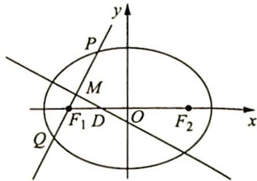

<!-- question-source:start -->
5. 如图所示, 已知椭圆 $C: \frac{x^2}{a^2} + \frac{y^2}{b^2} = 1 (a > b > 0)$ 的左、右焦点分别为 $F_1, F_2$ , 过左焦点 $F_1$ 的直线 $l$ 与椭圆 $C$ 相交于 $P, Q$ 两点, 作线段 $PQ$ 的垂直平分线交 $x$ 轴于点 $D$ , 求证: $\frac{|DF_1|}{|PQ|}$ 的值是一个常数.

<!-- question-source:end -->

![[Q00019539A1]]
