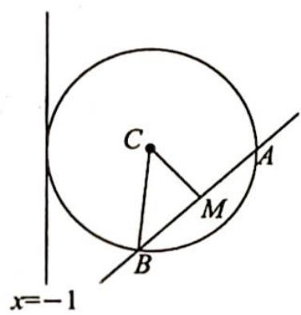

> [!faq]- 《高考数学培优40讲》参考答案
>
> > [!success]- **【答案】** 详见解析
>
> > [!note]- **【分析】**
> > 本题未单列分析。
>
> > [!note]- **【解析】**
> > (1)根据题意可得 $F(1,0)$ ，设直线 l 的倾斜角为 $\alpha(0^{\circ}<\alpha<90^{\circ})$ ，则根据抛物线的焦点弦长公式，有 $\left|AB\right|=\frac{2p}{\sin^{2}\alpha}=\frac{4}{\sin^{2}\alpha}=8$ ，所以 $\sin\alpha=\frac{\sqrt{2}}{2}\Rightarrow\alpha=45^{\circ}$ ，则直线 l 的斜率为 1，由此可得直线 l 的方程为 y=x-1。
> > (2)联立方程组 $\left\{ \begin{array}{l} y^{2} = 4x \\ y = x - 1 \end{array} \right.$ , 得 $x^{2} - 6x + 1 = 0$ , 设 $A(x_{1},y_{1}), B(x_{2},y_{2}), AB$ 的中点为 $M$ , 则 $x_{1} + x_{2} = 6, y_{1} +$ $y_{2}=x_{1}-1+x_{2}-1=4$ ，所以 $M\left(\frac{x_{1}+x_{2}}{2},\frac{y_{1}+y_{2}}{2}\right)=(3,2)$ ，直线 AB 的垂直平分线方程为 $y-2=-(x-3)$ ，即 $y=-x+5$ 。
> > 如图所示, 设过点 $A, B$ 的圆的圆心为 $(a, 5 - a)$ , 因为该圆与 $C$ 的准线 $x = -1$ 相切, 所以半径 $r = a + 1$ , 圆心 $(a, 5 - a)$ 到直线 $AB: y = x - 1$ 的距离 $d = \frac{|2a - 6|}{\sqrt{2}}$ , $|AB| = 8$ , 所以 $\left(\frac{|2a - 6|}{\sqrt{2}}\right)^2 + 4^2 = (a + 1)^2$ , 解得 $a = 3$ 或 $a = 11$ . 则圆心的坐标为 $(3, 2)$ , 半径为 4, 或圆心的坐标为 $(11, -6)$ , 半径为 12, 故圆的方程为 $(x - 3)^2 + (y - 2)^2 = 16$ 或 $(x - 11)^2 + (y + 6)^2 = 144$ .
> > 
