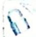

> [!faq]- 《高考数学培优40讲》例题解析
>
> > [!success]- **【答案】** 详见解析
>
> > [!note]- **【分析】**
> > 本题未单列分析。
>
> > [!note]- **【解析】**
> > 解析 (1) 因为 $a = 2\sqrt{2} b$ , 所以椭圆的方程为 $\frac{x^2}{8b^2} + \frac{y^2}{b^2} = 1$ .
> > 把点 $A\left(2, \frac{\sqrt{2}}{2}\right)$ 的坐标代入椭圆的方程，得 $\frac{4}{8b^2} + \frac{1}{2b^2} = 1$ ，所以 $b^2 = 1, a^2 = 8$ ，故椭圆的方程为 $\frac{x^2}{8} + y^2 = 1$ .
> > (2)设直线 l 的方程为 $y=kx+m(k\neq0)$ , $M(x_{1},y_{1})$ , $N(x_{2},y_{2})$ , 联立方程组 $\left\{\begin{aligned}\frac{x^{2}}{8}+y^{2}&=1\\ y&=kx+m\end{aligned}\right.$ 消去 y 得 $(1 + 8k^{2})x^{2} + 16kmx + 8m^{2} - 8 = 0$ .
> > 由 $256k^{2}m^{2}-32(m^{2}-1)(1+8k^{2})>0$ ，得 $m^{2}<1+8k^{2}$ ，所以 $x_{1}+x_{2}=-\frac{16km}{1+8k^{2}}$ , $x_{1}x_{2}= \frac{8m^{2}-8}{1+8k^{2}}$ ，则 $|MN|=\sqrt{1+k^{2}}\sqrt{(x_{1}+x_{2})^{2}-4x_{1}x_{2}}=\sqrt{1+k^{2}}\sqrt{\left(-\frac{16km}{1+8k^{2}}\right)^{2}-4\times\frac{8m^{2}-8}{1+8k^{2}}}=$ $\frac{4\sqrt{2}\sqrt{1+k^{2}}\sqrt{8k^{2}+1-m^{2}}}{1+8k^{2}}$ 。
> > 由 $\frac{4\sqrt{2}\sqrt{1 + k^2}\sqrt{8k^2 + 1 - m^2}}{1 + 8k^2} = 2\sqrt{2}$ 得， $m^2 = \frac{(8k^2 + 1)(3 - 4k^2)}{4(k^2 + 1)}$ 。
> > 令 $k^2 + 1 = t (t > 1) \Rightarrow k^2 = t - 1$ ，所以 $m^2 = \frac{-32t^2 + 84t - 49}{4t}, m^2 = 21 - \left(8t + \frac{49}{4t}\right) \leqslant 21 - 14\sqrt{2}$ ，即 $\sqrt{7} - \sqrt{14} \leqslant m \leqslant \sqrt{14} - \sqrt{7}$ .
> > 当且仅当 $8t = \frac{49}{4t}$ , 即 $t = \frac{7\sqrt{2}}{8}$ 时, 上式取等号, 此时 $k^2 = \frac{7\sqrt{2} - 8}{8}$ , 满足 $m^2 < 1 + 8k^2$ , 所以 $m$ 的最大值为 $\sqrt{14} - \sqrt{7}$ , 最小值为 $\sqrt{7} - \sqrt{14}$ .
> > 
