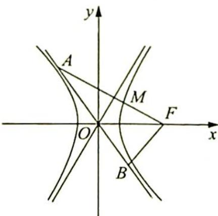

> [!faq]- 《高考数学培优40讲》例题解析
>
> > [!success]- **【答案】** 详见解析
>
> > [!note]- **【分析】**
> > 分析 ▶ 将向量条件转化为几何条件, $\overrightarrow{AF} \cdot \overrightarrow{BF} = 0$ 说明两线段垂直,结合双曲线的对称性挖掘几何性质,求出特殊角度.
>
> > [!note]- **【解析】**
> > 解析 如图所示, 由题知 $AF \perp BF$ , 则 $OA = OB = OF$ , 点 $M$ 是线段 $AF$ 的中点, 则 $OM \perp AF$ , 即 $OM$ 为 $AF$ 的垂直平分线, 所以 $\angle AOM = \angle MOF = \angle BOF$ , 故 $\angle AOM = \angle MOF = 60^\circ$ , 则 $\frac{b}{a} = \tan 60^\circ = \sqrt{3}$ , 所以 $e = \frac{c}{a} = \sqrt{1 + \left(\frac{b}{a}\right)^2} = \sqrt{1 + (\sqrt{3})^2} = 2$ .
> > 
