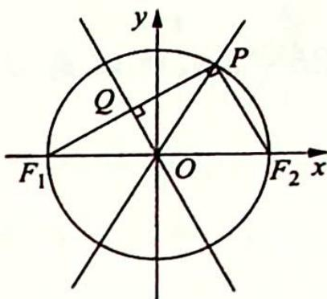
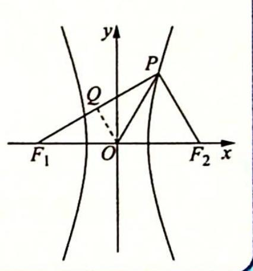

> [!faq]- 《高考数学培优40讲》例题解析
>
> > [!success]- **【答案】** C
>
> > [!note]- **【分析】**
> > 本题未单列分析。
>
> > [!note]- **【解析】**
> > 解析 ▶ 解法一(几何法): 由题意可知 $PF_{1} \perp PF_{2}$ , 又 $PF_{1}$ 的中点恰好在另一条渐近线上, 如图所示, 设 $PF_{1}$ 的中点为 $Q$ , 则 $OQ \perp PF_{1}$ .
> > 由双曲线的对称性知 $\angle QOF_{1}=\angle POF_{2}$ ,由垂径定理知 $\angle QOF_{1}=\angle QOP$ ,即渐近线 $OP$ 的
> > 倾斜角为 $\frac{\pi}{3}$ , 所以 $\frac{b}{a} = \sqrt{3}, e = \frac{c}{a} = \sqrt{\frac{a^2 + b^2}{a^2}} = \sqrt{1 + 3} = 2$ , 故选 C.
> > 解法二(坐标法): 设点 $P(x_{0}, y_{0})$ ，则 $\left\{\begin{aligned}\frac{y_{0}}{x_{0}} &= \frac{b}{a} \\ x_{0}^{2} &= y_{0}^{2} = c^{2}\end{aligned}\right.$ ，解得 $\left\{\begin{aligned}x_{0} &= a \\ y_{0} &= b\end{aligned}\right.$ .
> > 
> > 又 $PF_{1}$ 的中点 Q 在另一条渐近线上, 所以 $Q\left(\frac{x_{0}-c}{2}, \frac{y_{0}}{2}\right)$ , 且 $k_{QQ} = \frac{y_{0}}{x_{0}-c} = -\frac{b}{a}$ , 即 $\frac{b}{a-c} = -\frac{b}{a}$ , 则 c = 2a.
> > 所以 C 的离心率 $e=\frac{c}{a}=2$ ，故选 C.
> > ## 评注
> > 本题破解的关键是由数形结合找到 $P, F_{1}$ 关于直线 $y = -\frac{b}{a} x$ 对称, 有一中一垂两个条件可用. 涉及圆的性质、双曲线的性质及直线的斜率.
> > 
