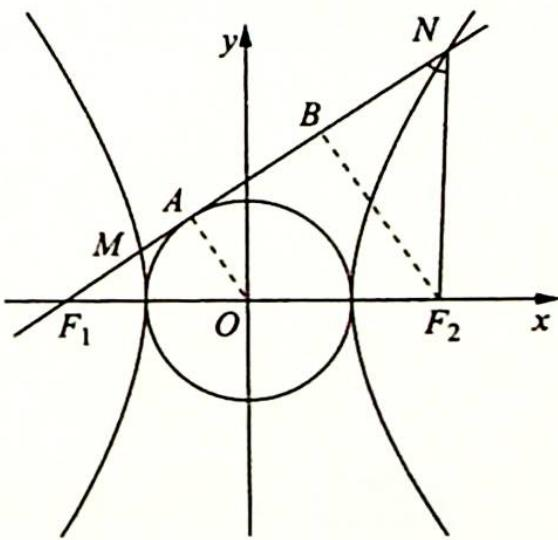
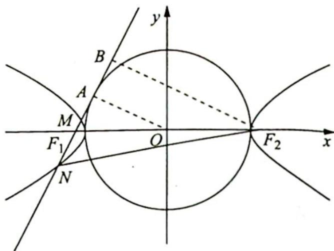

> [!faq]- 《高考数学培优40讲》例题解析
>
> > [!success]- **【答案】** C
>
> > [!note]- **【分析】**
> > 本题未单列分析。
>
> > [!note]- **【解析】**
> > 解析 ①依题意,圆 D 的圆心即为坐标原点 O,如图所示,若切线与双曲线的两支相交,记圆上的切点为 A,连接 OA,则 $\left|OA\right|=a$ 且 $OA\perp MN$ . 过 $F_{2}$ 作 $F_{2}B\perp MN$ 交 MN 于点 B,则 $F_{2}B\parallel OA$ .
> > 因为 O 为 $F_{1}F_{2}$ 的中点，则 $\left|F_{2}B\right|=2a,\left|F_{1}B\right|=2\left|F_{1}A\right|=2\sqrt{c^{2}-a^{2}}=2b.$
> > 
> > 因为 $\cos \angle F_{1}NF_{2} = \frac{3}{5}$ ，不妨设 $|BN| = 3m$ ， $|F_2N| = 5m$ ，则
> > $|BF_2| = 4m = 2a, m = \frac{a}{2}$ , 所以 $|BN| = \frac{3a}{2}, |F_2N| = \frac{5a}{2}$ , 则 $|F_1N| = |F_1B| + |BN| = 2b + \frac{3a}{2}$ .
> > 因为点 N 在双曲线上, 则根据双曲线的定义可知 $\left|F_{1}N\right| - \left|F_{2}N\right| = 2b + \frac{3a}{2} - \frac{5a}{2} = 2a$ , 即
> > $2b = 3a$ ，所以离心率 $e = \sqrt{1 + \frac{b^2}{a^2}} = \sqrt{1 + \frac{9}{4}} = \frac{\sqrt{13}}{2}$
> > - **②**：若切线与双曲线的一支交于两点,如图所示, $|OA|=a$ , $|F_{2}B|=2a$ . 在 Rt△NBF $_{2}$ 中,设 $|BN|=3m,|F_{2}N|=5m$ ,则 $|BF_{2}|=4m=2a,m=\frac{a}{2}$ .
> > 
> > 所以 $|BN| = \frac{3a}{2}, |F_2N| = \frac{5a}{2}$ , 则 $|F_1N| = |BN| - |F_1B| = \frac{3a}{2} - 2b$ .
> > 因为点 N 在双曲线上, 则根据双曲线的定义可知 $\left|F_{2}N\right| - \left|F_{1}N\right| = \frac{5a}{2} - \frac{3a}{2} + 2b = 2a, a = 2b$ , 所以离心率 $e = \sqrt{1 + \frac{b^{2}}{a^{2}}} = \sqrt{1 + \frac{1}{4}} = \frac{\sqrt{5}}{2}$ , A 选项正确.
> > 本题考查双曲线的定义及角度的几何条件转化,需要考生对特殊的数值具有一定的敏感度,如注意到 $\cos\angle F_{1}NF_{2}=\frac{3}{5}$ ,要能够联想到边长为 3,4,5 的直角三角形,进而将各线段长度通过直角三角形的长度关系用双曲线的参数进行表达.
> > 另外,由于本题未明确切线与双曲线是交于一支还是两支,因此有两个解.
> >
> > 故选 **C**.
