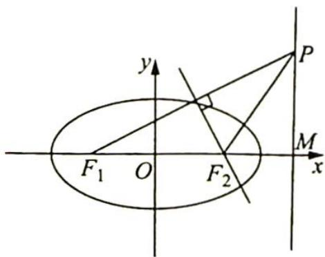

> [!faq]- 《高考数学培优40讲》例题解析
>
> > [!success]- **【答案】** C
>
> > [!note]- **【分析】**
> > 本题未单列分析。
>
> > [!note]- **【解析】**
> > 解析 如图所示, 设准线与 $x$ 轴的交点为 $M$ , 依题意, $|PF_{2}| = |F_{1}F_{2}| = 2c$ , $|F_{2}M| = \frac{a^{2}}{c} - c = \frac{b^{2}}{c}$ , 又 $|PF_{2}| \geqslant |F_{2}M|$ , 可得 $2c \geqslant \frac{b^{2}}{c}$ , 即 $2c^{2} \geqslant b^{2} = a^{2} - c^{2}$ , 因此 $3c^{2} \geqslant a^{2}$ , 故 $e^{2} \geqslant \frac{1}{3}$ , 得 $\frac{\sqrt{3}}{3} \leqslant e < 1$ , 故选 C.
> > 
