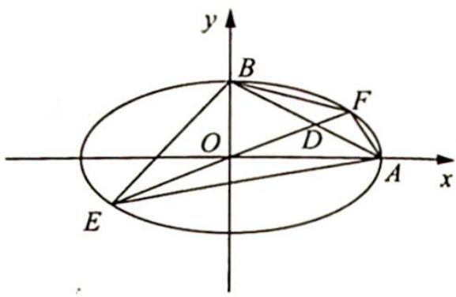

<!-- question-source:start -->
8. 已知椭圆的中心在坐标原点, $A(2,0), B(0,1)$ 是它的两个顶点, 直线 $y = kx (k > 0)$ 与直线 $AB$ 相交于点 $D$ , 与椭圆相交于 $E, F$ 两点.

(1) 若 $\overrightarrow{ED}=6\overrightarrow{DF}$ ，求 k 的值；

(2)求四边形 AEBF 面积的最大值.

<!-- question-source:end -->

![[Q00019565A1]]
