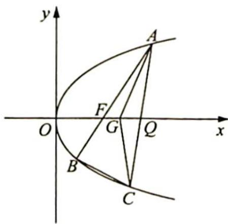

<!-- question-source:start -->
9.(2019 浙江卷理 21)如图所示,已知点 $F(1,0)$ 为抛物线 $y^{2}=2px(p>0)$ 的焦点,过点 $F$ 的直线交抛物线于 $A,B$ 两点,点 $C$ 在抛物线上,使得 $\triangle ABC$ 的重心 $G$ 在 $x$ 轴上,直线 $AC$ 交 $x$ 轴于点 $Q$ ,且 $Q$ 在点 $F$ 右侧.记 $\triangle AFG,\triangle CQG$ 的面积为 $S_{1},S_{2}$ .

(1) 求 p 的值及抛物线的准线方程；

(2)求 $\frac{S_{1}}{S_{2}}$ 的最小值及此时点G的坐标.

<!-- question-source:end -->

![[Q00019566A1]]
