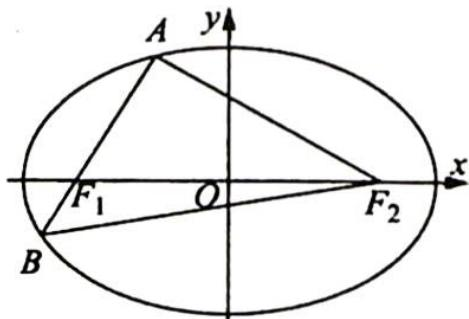

> [!faq]- 《高考数学培优40讲》参考答案
>
> > [!success]- **【答案】** 详见解析
>
> > [!note]- **【分析】**
> > 本题未单列分析。
>
> > [!note]- **【解析】**
> > 如图所示,设 $\left|A{F}_{1}\right| = {2m}\left( {m > 0}\right)$ ,因为 $\overrightarrow{A{F}_{1}} = 2\overrightarrow{{F}_{1}B}$ ,所以 $\left| B{F}_{1}\right|  = m$ .
> > 又 $\overrightarrow{AF_2} \cdot \overrightarrow{AF_1} = 0, |F_1F_2| = 2c$ ，所以 $|AF_2| = \sqrt{|F_1F_2|^2 - |AF_1|^2} = 2\sqrt{c^2 - m^2}$ ， $|BF_2| = \sqrt{|AB|^2 + |AF_2|^2} = \sqrt{4c^2 + 5m^2}$ ，且 $|AF_1| + |AF_2| = |BF_1| + |BF_2| = 2a$ ，
> > 所以 $2m + 2\sqrt{c^2 - m^2} = m + \sqrt{4c^2 + 5m^2}, m + 2\sqrt{c^2 - m^2} = \sqrt{4c^2 + 5m^2},$ $m^2 + 4c^2 - 4m^2 + 4m\sqrt{c^2 - m^2} = 4c^2 + 5m^2, c^2 = 5m^2,$ 即 $c = \sqrt{5} m.$
> > 又 $2a = 2m + 2\sqrt{c^2 - m^2} = 6m$ ，所以 $a = 3m, e = \frac{c}{a} = \frac{\sqrt{5}m}{3m} = \frac{\sqrt{5}}{3}$ 故答案为 $\frac{\sqrt{5}}{3}$ .
> > 
