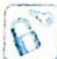

## 19.5 应用参数方程简化

## 研究密钥

在解决有些解析几何问题时,如果方法选择不当往往导致计算量过大,就不易得到正确的计算结果.适当引入参数,对于深入研究直线与圆锥曲线的关系十分重要,特别是解析几何中的最值问题、不等式问题等.用参数法解决问题关键在于设置合适的参数,列出参数方程,配之以相应的代数式变形,最后化为普通方程,往往可简化计算.

![[高中/总复习/专题/高考数学培优40讲/高考数学培优40讲-02-解析几何/第19讲_解析几何计算方法的系统研究/参数方程与极坐标/19_5_应用参数方程简化/例题/Q00019578.md]]
![[高中/总复习/专题/高考数学培优40讲/高考数学培优40讲-02-解析几何/第19讲_解析几何计算方法的系统研究/参数方程与极坐标/19_5_应用参数方程简化/例题/Q00019579.md]]
![[高中/总复习/专题/高考数学培优40讲/高考数学培优40讲-02-解析几何/第19讲_解析几何计算方法的系统研究/参数方程与极坐标/19_5_应用参数方程简化/例题/Q00019580.md]]
