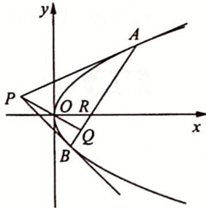

<!-- question-source:start -->
变式 1 如图所示, 在平面直角坐标系 $xOy$ 中, $P$ 是不在 $x$ 轴上的一个动点, 过点 $P$ 可作抛物线 $y^{2} = 4x$ 的两条切线, 两切点 $A, B$ 的连线与 $PO$ 垂直. 设直线 $AB$ 与直线 $PO, x$ 轴的交点分别为 $Q, R$ .

(1) 证明: R 是一个定点;

(2) 求 $\frac{|PQ|}{|QR|}$ 的最小值.
<!-- question-source:end -->

![[高中/总复习/专题/高考数学培优40讲/高考数学培优40讲-02-解析几何/第19讲_解析几何计算方法的系统研究/参数方程与极坐标/19_5_应用参数方程简化/例题/answers/Q00019579A1.md]]
