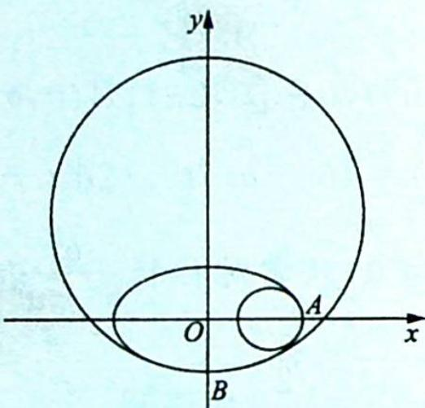
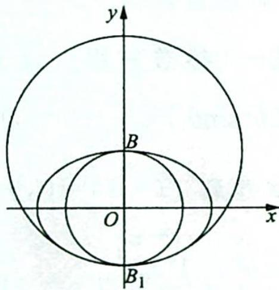
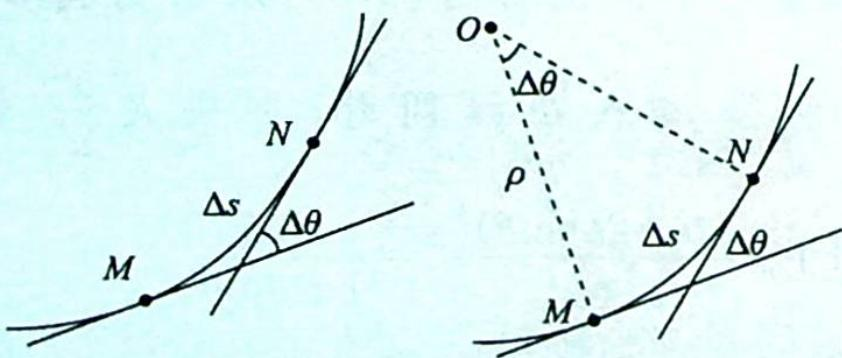

> [!faq]- 《高考数学培优40讲》例题解析
>
> > [!success]- **【答案】** C
>
> > [!note]- **【分析】**
> > 分析 ▶ 设 $P$ 的坐标为 $(a \cos \theta, b \sin \theta)$ , 表示出 $|PB|$ 的长, 根据 $|PB|^{2} \leqslant (2b)^{2}$ 得到关于 $a, b, \theta$ 的不等关系, 变形为关于 $\sin \theta$ 的二次函数. 思路一: 结合函数图像和 $\sin \theta$ 的有界性, 得到关于 $a, b$ 的齐次式, 可得离心率的取值范围. 思路二: 将二次函数因式分解, 利用 $\sin \theta$ 的有界性消去 $\sin \theta$ , 转化为关于 $a, b$ 的齐次不等式, 可得离心率的取值范围. 思路三: $C$ 上的任意一点 $P$ 都满足 $|PB| \leqslant 2b$ , 转化为图形语言, 即以 $B$ 为圆心, $2b$ 为半径的圆包含着椭圆 $C$ ; 再转化为不等式: 即用参数方程表示圆 $B$ 上的点, 则代入椭圆方程应大于等于 1 , 得到关于 $a, b$ 的齐次不等式, 进而可得离心率的取值范围.
>
> > [!note]- **【解析】**
> > 解析 ▶ 解法一(参数方程): 设 $P(a \cos \theta, b \sin \theta), \theta \in [0, 2\pi), B(0, b)$ , 由 $|PB|^2 \leqslant (2b)^2$ 得: $(b^2 - a^2) \sin^2 \theta - 2b^2 \sin \theta + a^2 - 3b^2 \leqslant 0$ , 只需 $f(t) = (b^2 - a^2)t^2 - 2b^2t + a^2 - 3b^2 \leqslant 0$ 在 $t \in [-1, 1]$ 上恒成立, 注意到 $f(-1) = 0, f(1) = -4b^2 < 0$ , 只需对称轴 $\frac{b^2}{b^2 - a^2} \leqslant -1$ 即可, 即 $b^2 \geqslant -(b^2 - a^2), 2b^2 \geqslant a^2, \frac{b^2}{a^2} \geqslant \frac{1}{2}$ , 所以 $e = \sqrt{1 - \frac{b^2}{a^2}} \leqslant \sqrt{1 - \frac{1}{2}} = \frac{\sqrt{2}}{2}$ , 故选 C.
> > 解法二(因式分解): 设 $P(a \cos \theta, b \sin \theta), \theta \in [0, 2\pi), B(0, b)$ , 由 $|PB|^2 \leqslant (2b)^2$ 得: $(b^2 - a^2) \sin^2 \theta - 2b^2 \sin \theta + a^2 - 3b^2 \leqslant 0$ , 而 $(b^2 - a^2) \sin^2 \theta - 2b^2 \sin \theta + a^2 - 3b^2 = (\sin \theta + 1)[(b^2 - a^2) \sin \theta + a^2 - 3b^2]$ .
> > 因为 $\sin\theta+1\geqslant0$ ，所以只需 $(b^{2}-a^{2})\sin\theta+a^{2}-3b^{2}\leqslant0$ 即可，即 $(b^{2}-a^{2})\cdot(-1)+a^{2}-3b^{2}\leqslant0$ 。后略，故选 C.
> > 解法三(曲线系,不等式有解): B 点坐标为 $(0,b)$ , 以 B 为圆心, 2b 为半径的圆上的点可设为 $(2b\cos\theta, b-2b\sin\theta)$ , 依题意得该点在椭圆外, 即满足 $\frac{x^{2}}{a^{2}} + \frac{y^{2}}{b^{2}} \geqslant 1$ , 这样 $\frac{4b^{2}\cos^{2}\theta}{a^{2}} + \frac{(b-2b\sin\theta)^{2}}{b^{2}} \geqslant 1$ , $\frac{b^{2}}{a^{2}} \geqslant \frac{1}{4\cos^{2}\theta} \left[1 - \frac{(b-2b\sin\theta)^{2}}{b^{2}}\right] = \frac{\sin\theta}{1 + \sin\theta}$ .
> > 因为 $\frac{\sin\theta}{1 + \sin\theta} \leqslant \frac{1}{2}$ , 故 $\frac{b^{2}}{a^{2}}$ 的最小值是 $\frac{1}{2}$ . 后略, 故选 C.
> > 
> > 探索新知
> > # 曲率圆与曲率半径
> > 如图1所示,椭圆 $\frac{x^{2}}{a^{2}}+\frac{y^{2}}{b^{2}}=1(a>b>0)$ 上长轴端点A和短轴端点B处的曲率半径分别为r= $\frac{b^{2}}{a}$ , $R=\frac{a^{2}}{b}$ ，从A到B曲率圆半径增大。所以A处圆刚好被椭圆包络，B处圆刚好把椭圆包络。
> > 上述例题还可将椭圆的变化推向极限,通过曲率圆的半径加以解决.
> > 如图 2 所示, 根据题意, 不妨设圆心 $(0, b)$ , 半径 2b 的圆固定, 椭圆变化仅当椭圆完全在圆内时满足题意, 所以椭圆有 2 种临界情况:
> > - **①**：趋近于圆 $x^{2}+y^{2}=b^{2}$ 的椭圆, 其离心率 $e\to0$ .
> > - **②**：曲率圆为 $x^{2} + (y - b)^{2} = 4b^{2}$ （图2中外层的大圆）的椭圆，该椭圆的曲率半径 $R = \frac{a^2}{b} = 2b \Rightarrow e = \frac{\sqrt{2}}{2}$ . 所以离心率可在 $\left(0, \frac{\sqrt{2}}{2}\right]$ 中变化.
> > 
> > 图 1
> > 
> > 图 2
> > 曲率半径:在光滑弧线上自 M 点开始取一段弧 MN, 其弧长为 $\Delta s, M, N$ 处切线的转角为 $\Delta\theta$ , 如图所示, 定义: 弧段 $\Delta s$ 上的平均曲率 $\bar{k} = \left| \frac{\Delta\theta}{\Delta s} \right|$ ; 点 M 处的曲率, 即当 $\Delta s \to 0$ 时, k = $\lim_{\Delta s \to 0} \left| \frac{\Delta\theta}{\Delta s} \right| = \left| \frac{d\theta}{ds} \right|$ .
> > 注意:直线上任意一点的曲率为0.
> > 
> > 若在 M 点附近取一小段曲线, 恰好与某个圆的一小段圆弧重合, 则该圆称为曲率圆, 它的圆心为曲率中心, 它的半径称为曲率半径 $\rho$ .
> > 由 $\Delta s = \rho \cdot \Delta \theta$ ，可得 $\rho = \frac{\Delta s}{\Delta \theta} = \frac{1}{k}$ ，所以 $\rho = \frac{1}{k}$ .
> > 曲率半径的数学求法：
> > 已知曲线的方程 $y = f(x)$ ，则曲率半径 $\rho = \frac{(1 + y'^2)^{\frac{3}{2}}}{|y''|}$ ， $y'$ ， $y''$ 分别为函数 $f(x)$ 的一阶、二阶导数；如曲线的参数方程为 $x = x(t)$ ， $y = y(t)$ ，则曲率半径 $\rho = \frac{(x'(t)^2 + y'(t)^2)^{\frac{3}{2}}}{|x'(t)y''(t) - y'(t)x''(t)|}$ ，其中 $x'(t), x''(t), y'(t), y''(t)$ 分别为 $x, y$ 对时间 $t$ 的一阶、二阶导数，也就是 $x, y$ 方向的速度和加速度。
