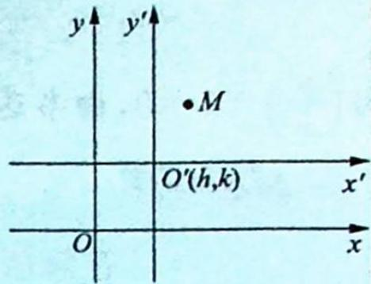

> [!faq]- 《高考数学培优40讲》例题解析
>
> > [!success]- **【答案】** 详见解析
>
> > [!note]- **【分析】**
> > 本题未单列分析。
>
> > [!note]- **【解析】**
> > 解析 ▶ 以原点为极点, $Ox$ 轴正半轴为极轴建立极坐标系, 将 $x = \rho \cos \theta$ , $y = \rho \sin \theta$ 代入 $\frac{x^2}{a^2} + \frac{y^2}{b^2} = 1$ , 得 $\rho^2 = \frac{a^2 b^2}{b^2 \cos^2 \theta + a^2 \sin^2 \theta}$ .
> > 设 $A(\rho_1, \alpha), B\left(\rho_2, \alpha + \frac{\pi}{2}\right)$ ，则 $\rho_1 = \frac{ab}{\sqrt{b^2 \cos^2 \alpha + a^2 \sin^2 \alpha}}$
> > $$
> > \rho_ {2} = \frac {a b}{\sqrt {b ^ {2} \cos^ {2} \left(\alpha + \frac {\pi}{2}\right) + a ^ {2} \sin^ {2} \left(\alpha + \frac {\pi}{2}\right)}} = \frac {a b}{\sqrt {b ^ {2} \sin^ {2} \alpha + a ^ {2} \cos^ {2} \alpha}}.
> > $$
> > 所以 $S_{\triangle AOB} = \frac{1}{2} |OA| |OB| = \frac{1}{2} \rho_{1} \rho_{2} = \frac{1}{2} \frac{ab}{\sqrt{b^{2} \cos^{2}\alpha + a^{2} \sin^{2}\alpha}} \cdot \frac{ab}{\sqrt{b^{2} \sin^{2}\alpha + a^{2} \cos^{2}\alpha}} = \frac{1}{2} \frac{a^{2} b^{2}}{\sqrt{(b^{2} + c^{2} \sin^{2}\alpha)(a^{2} - c^{2} \sin^{2}\alpha)}} = \frac{1}{2} \frac{a^{2} b^{2}}{\sqrt{-c^{4} (\sin^{2}\alpha - \frac{1}{2})^{2} + a^{2} b^{2} + \frac{1}{4} c^{4}}}$ .
> > 当 $\sin^{2}\alpha = 0$ 或 1 时， $S_{\triangle AOB}$ 有最大值为 $\frac{1}{2}ab$ ; 当 $\sin^{2}\alpha = \frac{1}{2}$ 时， $S_{\triangle AOB}$ 有最小值为 $\frac{1}{2}\frac{a^{2}b^{2}}{\sqrt{a^{2}b^{2}+\frac{1}{4}(a^{2}-b^{2})^{2}}}=\frac{1}{2}\frac{a^{2}b^{2}}{\sqrt{\frac{1}{4}(a^{2}+b^{2})^{2}}}=\frac{a^{2}b^{2}}{a^{2}+b^{2}}.$
> > ## 评注
> > 本题还可以从垂直弦模型角度解答:如图所示,设 OA = x, OB = y, (x > 0, y > 0), 则 $AB = \sqrt{x^{2} + y^{2}}$ .
> > 过点 O 作 $OH \perp AB$ 交 AB 于点 H，因为 $OA \perp OB$ ，所以 $\frac{1}{OH^{2}} = \frac{1}{a^{2}} + \frac{1}{b^{2}}$ ，则 $|OH| = \frac{ab}{\sqrt{a^{2} + b^{2}}}$ .
> > 
> > 由垂直弦模型可知， $\frac{1}{x^{2}}+\frac{1}{y^{2}}=\frac{1}{a^{2}}+\frac{1}{b^{2}}.$
> > $$
> > \left| A B \right| ^ {2} = x ^ {2} + y ^ {2} = (x ^ {2} + y ^ {2}) \cdot \left(\frac {1}{x ^ {2}} + \frac {1}{y ^ {2}}\right) \cdot \frac {1}{\frac {1}{a ^ {2}} + \frac {1}{b ^ {2}}}
> > $$
> > $$
> > = \left(2 + \frac {y ^ {2}}{x ^ {2}} + \frac {x ^ {2}}{y ^ {2}}\right) \cdot \frac {a ^ {2} b ^ {2}}{a ^ {2} + b ^ {2}} \geqslant 4 \cdot \frac {a ^ {2} b ^ {2}}{a ^ {2} + b ^ {2}}.
> > $$
> > 当且仅当 $x = y$ ，即 $OA = OB$ 时取等号，所以 $\left|AB\right|_{\min} = \frac{2ab}{\sqrt{a^2 + b^2}}.$
> > $|AB|^{2}=\left(2+\frac{y^{2}}{x^{2}}+\frac{x^{2}}{y^{2}}\right)\cdot\frac{a^{2}b^{2}}{a^{2}+b^{2}}$ ，由对勾函数的单调性可知，当x与y差距越大， $|AB|$ 越大，即当 x=a, y=b 或 x=b, y=a 时， $|AB|$ 有最大值， $|AB|_{\max}=\sqrt{a^{2}+b^{2}}$
> > 又 $S_{\triangle OAB} = \frac{1}{2}|AB||OH| = \frac{ab}{2}\cdot \frac{1}{\sqrt{a^2 + b^2}}\cdot |AB|$ ，所以当 $OA = OB$ 时， $S_{\triangle OAB}$ 取得最小值为 $\frac{a^2b^2}{a^2 + b^2}$
> > 当 $OA = a, OB = b$ 或 $OA = b, OB = a$ 时， $S_{\triangle OAB}$ 取得最大值为 $\frac{1}{2} ab$ .
> > 
> > ## 坐标平稳齐次化
> > 
> > ## 研究密钥
> > ## 一、坐标系的平移
> > 我们知道,点的坐标和曲线方程都是对于一个确定的坐标系而言的.在不同的坐标系中,同一曲线会有不同的方程,但是曲线的形状、大小是曲线所固有的,它们不受坐标系选择的影响.进行坐标系的平移是为了化简曲线的方程,例如圆 $(x-3)^{2}+(y-2)^{2}=1$ 的圆心为点(3,2),若把坐标原点移到点(3,2),且不改变坐标轴的方向和单位长度,则方程可以写成 $x^{2}+y^{2}=1$ ,由此可得如下定义:坐标轴的方向和单位长度都不改变,只改变原点的位置,这种
> > 坐标系的变换叫作坐标系的平移.
> > 如图所示, 设点 $O'$ 在原坐标系中的坐标为 $(h, k)$ , 以 $O'$ 为原点平移坐标系, 建立新的坐标系. 设点 $M$ 在原坐标系中的坐标为 $(x, y)$ , 在新坐标系中的坐标为 $(x', y')$ , 则 $\left\{ \begin{array}{l} x' = x - h \\ y' = y - k \end{array} \right.$ 或 $\left\{ \begin{array}{l} x = x' + h \\ y = y' + k \end{array} \right.$ , 这称为坐标平移公式.
> > 
