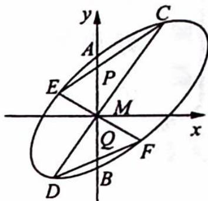

> [!faq]- 《高考数学培优40讲》例题解析
>
> > [!success]- **【答案】** 详见解析
>
> > [!note]- **【分析】**
> > 本题未单列分析。
>
> > [!note]- **【解析】**
> > 解析 如图所示,以 M 为原点,AB 所在的直线为 y 轴,建立直角坐标系.
> > 设圆锥曲线的方程为: $Ax^{2} + Bxy + Cy^{2} + Dx + Ey + F = 0$ (\*).
> > 设 $A(0, t), B(0, -t)$ , 可知 $t, -t$ 是 $Cy^2 + Ey + F = 0$ 的两个根, 所以 $E = 0$ .
> > 若 $CD, EF$ 有一条斜率不存在, 则点 $P, Q$ 与点 $A, B$ 重合, 结论成立.
> > 
> > 若 $CD, EF$ 斜率都存在，设 $C(x_{1}, k_{1}x_{1}), D(x_{2}, k_{1}x_{2}), E(x_{3}, k_{2}x_{3}), F(x_{4}, k_{2}x_{4}), P(0, p)$ ，
> > $$
> > Q (0, q)
> > $$
> > $$
> > C E: y = \frac {k _ {2} x _ {3} - k _ {1} x _ {1}}{x _ {3} - x _ {1}} \cdot (x - x _ {1}) + k _ {1} x _ {1}, p = \frac {k _ {2} x _ {3} - k _ {1} x _ {1}}{x _ {3} - x _ {1}} \cdot (0 - x _ {1}) + k _ {1} x _ {1} =
> > $$
> > $$
> > \frac {x _ {1} x _ {3} \left(k _ {1} - k _ {2}\right)}{x _ {3} - x _ {1}}
> > $$
> > $$
> > q = \frac {x _ {2} x _ {4} (k _ {1} - k _ {2})}{x _ {4} - x _ {2}}
> > $$
> > $$
> > p + q = \frac {\left(k _ {1} - k _ {2}\right) \left[ x _ {3} x _ {4} \left(x _ {1} + x _ {2}\right) - x _ {1} x _ {2} \left(x _ {3} + x _ {4}\right) \right]}{\left(x _ {4} - x _ {2}\right) \left(x _ {3} - x _ {1}\right)}
> > $$
> > 将 $y = k_{1}x$ 代入（ $*$ ）得 $(A + Bk_{1} + Ck_{1}^{2})x^{2} + (D + Ek_{1})x + F = 0$ ，由 $E = 0$ ，得 $x_{1} + x_{2} = \frac{-D}{A + Bk_{1} + Ck_{1}^{2}}, x_{1}x_{2} = \frac{F}{A + Bk_{1} + Ck_{1}^{2}}.$
> > 同理 $x_{3} + x_{4} = \frac{-D}{A + Bk_{2} + Ck_{2}^{2}}, x_{3}x_{4} = \frac{F}{A + Bk_{2} + Ck_{2}^{2}}$ ，所以 $p + q = 0$ ，即 $|MP| = |MQ|$ .
