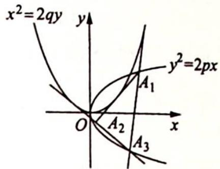

<!-- question-source:start -->
变式(1) 如图所示,抛物线 $y^{2} = 2px$ 的内接三角形有两边与抛物线 $x^{2} = 2qy$ 相切,证明:

这个三角形的第三边也与 $x^{2}=2qy$ 相切.

<!-- question-source:end -->

![[高中/总复习/专题/高考数学培优40讲/高考数学培优40讲-02-解析几何/第19讲_解析几何计算方法的系统研究/对称与非对称/19_3_对称结构的简化计算/例题/answers/Q00019573A1.md]]
