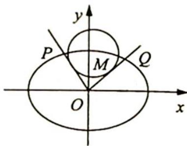

<!-- question-source:start -->
1. 如图所示, 在平面直角坐标系中, 点 $M(x_0, y_0)$ 在椭圆 $C: \frac{x^2}{a^2} + \frac{y^2}{b^2} = 1 (a > b > 0)$ 上, 从原点 $O$ 向圆 $M: (x - x_0)^2 + (y - y_0)^2 = r^2$ 作两条切线分别与椭圆 $C$ 交于点 $P, Q$ , 若直线 $OP, OQ$ 的

$$
k _ {1} k _ {2} = - \frac {b ^ {2}}{a ^ {2}}
$$

$$
k _ {1}, k _ {2}
$$

(1) 求证: $|OP|^2 + |OQ|^2 = a^2 + b^2$ ;

(2) 求证: $r^2 = \frac{a^2b^2}{a^2 + b^2}$ .

<!-- question-source:end -->

![[Q00019591A1]]
