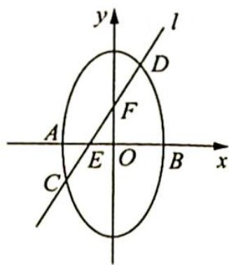

<!-- question-source:start -->
5. 如图所示, 椭圆 $x^{2} + \frac{y^{2}}{4} = 1$ 短轴的左右两个端点分别为 $A, B$ , 直线 $l: y = kx + 1$ 与 $x$ 轴, $y$ 轴分别交于两点 $E, F$ , 与椭圆交于两点 $C, D$ .

(1) 若 $\overrightarrow{CE} = \overrightarrow{FD}$ ，求直线 l 的方程；

(2)设直线 $AD, CB$ 的斜率分别为 $k_{1}, k_{2}$ , 若 $k_{1}: k_{2} = 2: 1$ , 求 $k$ 的值.

<!-- question-source:end -->

![[Q00019595A1]]
