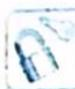

## 19.1 设线: 圆锥曲线硬解公式

## 研究密钥

圆锥曲线硬解公式是一套求解椭圆、双曲线与直线相交时， $x_{1}+x_{2},x_{1}x_{2}$ ，弦长的简便算法。设直线 $y=kx+m$ ，椭圆 $\frac{x^{2}}{a^{2}}+\frac{y^{2}}{b^{2}}=1$ ，联立直线与椭圆 $\left\{\begin{aligned}b^{2}x^{2}+a^{2}y^{2}-a^{2}b^{2}&=0\\ y=kx+m\end{aligned}\right.$ ，消 y 得 $\underbrace{(b^{2}+a^{2}k^{2})x^{2}+\underbrace{2a^{2}kmx}_{B}+\underbrace{a^{2}m^{2}-a^{2}b^{2}}_{C}=0.$

$$
\text {   ①韦达定理:   } \left\{ \begin{array}{l} x _ {1} + x _ {2} = \frac {- 2 a ^ {2} k m}{b ^ {2} + a ^ {2} k ^ {2}} \\ x _ {1} x _ {2} = \frac {a ^ {2} m ^ {2} - a ^ {2} b ^ {2}}{b ^ {2} + a ^ {2} k ^ {2}} \end{array} , \left\{ \begin{array}{l} y _ {1} + y _ {2} = \frac {2 b ^ {2} m}{b ^ {2} + a ^ {2} k ^ {2}} \\ y _ {1} y _ {2} = \frac {b ^ {2} m ^ {2} - a ^ {2} b ^ {2} k ^ {2}}{b ^ {2} + a ^ {2} k ^ {2}} \end{array} , x _ {1} y _ {2} + x _ {2} y _ {1} = \frac {- 2 k a ^ {2} b ^ {2}}{b ^ {2} + a ^ {2} k ^ {2}}; \right. \right.
$$

②判别式: $\Delta=4a^{2}b^{2}(b^{2}+a^{2}k^{2}-m^{2})$ ;

$$
\begin{array}{r l} & {\text {   ③弦长公式:   } | A B | = \sqrt {1 + k ^ {2}} \cdot | x _ {1} - x _ {2} | = \sqrt {1 + k ^ {2}} \cdot \left| \frac {- B + \sqrt {\Delta}}{2 A} - \frac {- B - \sqrt {\Delta}}{2 A} \right|} \\ & {\qquad = \sqrt {1 + k ^ {2}} \frac {\sqrt {\Delta}}{| A |} = \sqrt {1 + k ^ {2}} \cdot \frac {\sqrt {4 a ^ {2} b ^ {2} (b ^ {2} + a ^ {2} k ^ {2} - m ^ {2})}}{b ^ {2} + a ^ {2} k ^ {2}}.} \end{array}
$$

![[高中/总复习/专题/高考数学培优40讲/高考数学培优40讲-02-解析几何/第19讲_解析几何计算方法的系统研究/设线与设点/19_1_设线_圆锥曲线硬解公式/例题/Q00019567.md]]
![[高中/总复习/专题/高考数学培优40讲/高考数学培优40讲-02-解析几何/第19讲_解析几何计算方法的系统研究/设线与设点/19_1_设线_圆锥曲线硬解公式/例题/Q00019568.md]]
![[高中/总复习/专题/高考数学培优40讲/高考数学培优40讲-02-解析几何/第19讲_解析几何计算方法的系统研究/设线与设点/19_1_设线_圆锥曲线硬解公式/例题/Q00019569.md]]
