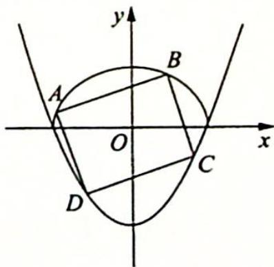

<!-- question-source:start -->
变式(2) (2022年04月江苏南京、盐城二模)如图所示,平行四边形ABCD的顶点A,B在

曲线 $C_{1}:\frac{x^{2}}{4}+\frac{y^{2}}{3}=1(y\geqslant0)$ 上，点 C, D 在曲线 $C_{2}:y=\frac{3}{4}(x^{2}-4)$ 上，直线 AB 方程为 $y=kx+1$ .

(1)用 $k$ 表示 $\vert AB\vert$ ；

(2)求直线 $CD$ 在 $y$ 轴上截距的最大值.
<!-- question-source:end -->

![[高中/总复习/专题/高考数学培优40讲/高考数学培优40讲-02-解析几何/第19讲_解析几何计算方法的系统研究/设线与设点/19_1_设线_圆锥曲线硬解公式/例题/answers/Q00019569A1.md]]
