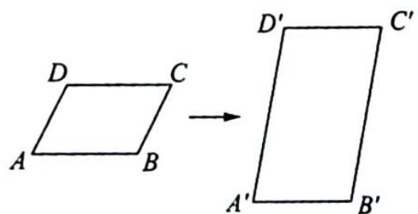

## 20.2 仿射变换的基本性质

性质 1: 仿射变换把直线变成直线, 把线段变成线段.

性质2:仿射变换把平行直线变成平行直线,把相交直线变成相交直线,把交点变成交点.

性质3:仿射变换把共线的三点变成共线的三点,把不共线的三点变成不共线的三点.

性质4:仿射变换保持共线三点的简单比值不变,即设 $f(A)=A',f(B)=B',f(C)=C'$ ,如果 $\overrightarrow{AC}=\lambda\overrightarrow{CB}$ ,那么 $\overrightarrow{A'C'}=\lambda\overrightarrow{C'B'}$ .特别地,仿射变换把线段的中点仍然变成线段的中点.

性质5:仿射变换把二次曲线的切线仍然变成二次曲线的切线,把切点仍然变成切点.

解析 因为仿射变换是可逆的,所以仿射变换引起了坐标平面上的点到同一个坐标平面上的点之间的一一对应,所以如果一条直线与另一条曲线相切(有两个重合的交点),那么这条直线的象直线与这条曲线的象曲线也相切(有两个重合的交点),即直线与曲线的位置关系在仿射变换下保持不变.

(注:象直线(曲线)指经仿射变换后对应得到的原直线(曲线)的象.)

性质6: 如果仿射变换 $f: \left\{ \begin{array}{l} x' = ax + by + x_0 \\ y' = cx + dy + y_0 \end{array} \right.$ , 把平行四边形ABCD变成平行四边形 $A'B'C'D'$ , 那么 $\frac{S_{A'B'C'D'}}{S_{ABCD}} = |ad - bc|$ .

解析 如图所示,在平面直角坐标系 $xOy$ 中,设 $A(x_1,y_1),B(x_2,y_2),D(x_3,y_3)$ .

根据 $\left\{\begin{aligned}x^{\prime}&=ax+by+x_{0}\\ y^{\prime}&=cx+dy+y_{0}\end{aligned}\right.$ ，可得 $A^{\prime}(x_{1}^{\prime},y_{1}^{\prime})$ ， $B^{\prime}(x_{2}^{\prime},y_{2}^{\prime})$ ， $D^{\prime}(x_{3}^{\prime},y_{3}^{\prime})$ 的坐标满足： $\left\{\begin{aligned}x_{1}^{\prime}&=ax_{1}+by_{1}+x_{0}\\ y_{1}^{\prime}&=cx_{1}+dy_{1}+y_{0}\end{aligned}\right.,\left\{\begin{aligned}x_{2}^{\prime}&=ax_{2}+by_{2}+x_{0}\\ y_{2}^{\prime}&=cx_{2}+dy_{2}+y_{0}\end{aligned}\right.,\left\{\begin{aligned}x_{3}^{\prime}&=ax_{3}+by_{3}+x_{0}\\ y_{3}^{\prime}&=cx_{3}+dy_{3}+y_{0}\end{aligned}\right.$ ，所以 $\overrightarrow{AB}=(x_{2}-x_{1},y_{2}-y_{1}),\overrightarrow{AD}=$ $(x_{3}-x_{1},y_{3}-y_{1})$ ，且 $\overrightarrow{A'B'}=(x_2'-x_1',y_2'-y_1')=(a(x_2-x_1)+b(y_2-y_1),c(x_2-y_1)+d(y_2-y_1))$ ， $\overrightarrow{A'D'}=(x_3'-x_1',y_3'-y_1')=(a(x_3-x_1)+b(y_3-y_1),c(x_3-x_1)+d(y_3-y_1))$ 。

所以 $S_{A'B'C'D'} = |\overrightarrow{A'B'} \times \overrightarrow{A'D'}| = |[a(x_2 - x_1) + b(y_2 - y_1)][c(x_3 - x_1) + d(y_3 - y_1)] - [a(x_3 - x_1) + b(y_3 - y_1)][c(x_2 - x_1) + d(y_2 - y_1)]| = |ad - bc| \mid (x_2 - x_1)(y_3 - y_1) - (x_3 - x_1)(y_2 - y_1)|.$

(注:向量叉乘 $|\alpha\times\beta|=|\alpha||\beta|\sin\theta,\theta$ 为向量 $\alpha,\beta$ 之间的夹角, $|\alpha\times\beta|$ 的几何意义即等于向量 $\alpha,\beta$ 构成的平行四边形的面积.)

$S_{ABCD}=|\overrightarrow{AB}\times\overrightarrow{AD}|=|(x_{2}-x_{1})(y_{3}-y_{1})-(x_{3}-x_{1})(y_{2}-y_{1})|$ ，所以 $\frac{S_{A^{\prime}B^{\prime}C^{\prime}D^{\prime}}}{S_{ABCD}}=|ad-bc|$ .

性质7: 如果平面上任意一个有面积的区域 D 经过仿射变换 $f: \left\{\begin{array}{l} x' = ax + by + x_{0} \\ y' = cx + dy + y_{0} \end{array}\right.$ 变成区域

$D^{\prime}$ ，那么 $\frac{S_{D'}}{S_D} = |ad - bc|$

解析 ▶ 用两组平行直线分割区域 D，由于仿射变换把平行直线变成平行直线，因此相应地有两组平行直线分割区域 $D'$ 。用 $S_{1}(S_{1}')$ 表示在区域 $D(D')$ 内的所有平行四边形面积的总和；用 $S_{2}(S_{2}')$ 表示至少与区域 $D(D')$ 有一个公共点的平行四边形面积的总和，则有 $S_{1}' \leqslant S_{D'} \leqslant S_{2}'$ (\*). 由于 $S_{1}' = |ad - bc|S_{1}, S_{2}' = |ad - bc|S_{2}$ ，代入 (\*) 式得 $|ad - bc|S_{1} \leqslant S_{D'} \leqslant |ad - bc|S_{2}$ (\* \*).

由于用两组平行直线无限细分区域 $D$ 时, 有 $\lim S_{1} = S_{D}, \lim S_{2} = S_{D}$ , 所以对 $(\ast \ast)$ 式取极限即可得到 $|ad - bc|S_{D} \leqslant S_{D'} \leqslant |ad - bc|S_{D}$ , 即得 $S_{D'} = |ad - bc|S_{D}$ .
