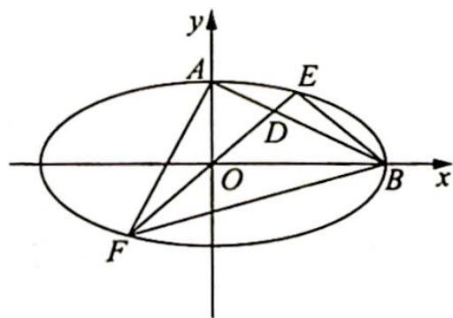

<!-- question-source:start -->
例 20.6 (2008 年全国 I 卷理 21 改编) 如图 1 所示, 在直角坐标系中, 椭圆方程为 $\frac{x^{2}}{4} + y^{2} = 1, A, B$ 分别为上顶点和右顶点. 过原点 $O$ 的直线 $y = kx (k > 0)$ 与线段 $AB$ 交于点 $D$ , 与椭圆交于 $E, F$ 两点.

(1) 若 $\overrightarrow{FD}=6\overrightarrow{DE}$ ，求 k 的值；

图 1

(2) 求四边形 AEBF 面积的最大值.
<!-- question-source:end -->

![[高中/总复习/专题/高考数学培优40讲/高考数学培优40讲-02-解析几何/第20讲_仿射变换/仿射变换的概念与性质/20_4_仿射变换性质应用/例题/answers/Q00019602A1.md]]
