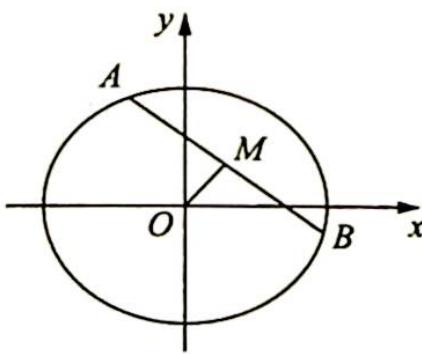

<!-- question-source:start -->
例 20.8 (椭圆的垂径定理) 如图 1 所示, 已知椭圆的方程为 $\frac{x^{2}}{a^{2}} + \frac{y^{2}}{b^{2}} = 1 (a > b > 0), A, B$ 是椭圆上的两点, 如果点 $M$ 为线段 $AB$ 的中点, 那么 $k_{OM} \cdot k_{AB} = -\frac{b^{2}}{a^{2}}$ , 其中 $k_{OM}, k_{AB}$ 分别表示直线 $OM, AB$ 的斜率; 反之, 如果 $k_{OM} \cdot k_{AB} = -\frac{b^{2}}{a^{2}}$ , 那么点 $M$ 为线段 $AB$ 的中点.

图 1
<!-- question-source:end -->

![[高中/总复习/专题/高考数学培优40讲/高考数学培优40讲-02-解析几何/第20讲_仿射变换/仿射变换的概念与性质/20_4_仿射变换性质应用/例题/answers/Q00019604A1.md]]
