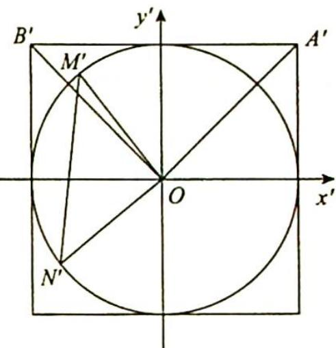

> [!faq]- 《高考数学培优40讲》例题解析
>
> > [!success]- **【答案】** 详见解析
>
> > [!note]- **【分析】**
> > 分析 ▶ 作仿射变换将椭圆变为圆,求出变换后圆中三角形的
> >
> > 面积, 再由性质 8, 椭圆与仿射变换所得圆中对应图形的面积关系求出椭圆中 $\triangle OMN$ 的面积. 其中圆中 $\triangle OM'N'$ 的面积可利用仿射变换后对应半径的垂直关系求出.
>
> > [!note]- **【解析】**
> > 解析 如图2所示,作仿射变换 $\left\{\begin{aligned}x^{\prime}&=x\\ y^{\prime}&=2y\end{aligned}\right.$ ，则椭圆 $C:\frac{x^{2}}{4}+y^{2}=1$ 变为圆 $C^{\prime}:x^{\prime2}+y^{\prime2}=4$ ，点A,B,M,N变换后对应的点分别为 $A^{\prime},B^{\prime}$ ， $M^{\prime},N^{\prime}$ ，且 $A^{\prime}(2,2),B^{\prime}(-2,2)$ ，所以 $\left\{\begin{aligned}k_{OA^{\prime}}&\cdot k_{OB^{\prime}}=2k_{OA}\cdot2k_{OB}=-1\\ k_{OM^{\prime}}&\cdot k_{ON^{\prime}}=2k_{OM}\cdot2k_{ON}\end{aligned}\right.$ ，又因为 $k_{OA}\cdot k_{OB}=k_{OM}\cdot k_{ON}$ ，则 $k_{OA^{\prime}}\cdot k_{OB^{\prime}}=k_{OM^{\prime}}\cdot k_{ON^{\prime}}=-1$ ，即 $OM^{\prime}\perp ON^{\prime}$ ，所以 $S_{\triangle OM^{\prime}N^{\prime}}=\frac{1}{2}|OM^{\prime}||ON^{\prime}|=\frac{1}{2}\times2\times2=2$ ，所以 $S_{\triangle OMN}=\frac{1}{2}S_{\triangle OM^{\prime}N^{\prime}}=1$ 。
> > 
> > 图 2
