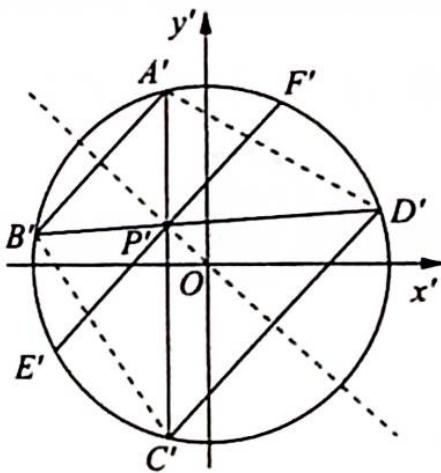

> [!faq]- 《高考数学培优40讲》例题解析
>
> > [!success]- **【答案】** 详见解析
>
> > [!note]- **【分析】**
> > 分析 (1)作仿射变换将椭圆变为圆,要证直线 $AB$ 的斜率为定值,转化为在圆中求直线 $A'B'$ 的斜率,再转化为求 $OP'$ 的斜率; (2)要证点 $P$ 平分线段 $EF$ ,即在圆中证 $P'$ 平分线段 $E'F'$ ,根据垂径定理转化为证明 $OP'\perp E'F'$ .
>
> > [!note]- **【解析】**
> > 解析 如图2所示, 把 $xOy$ 平面上所有点的横坐标不变, 纵坐标变为原来的 2 倍 $\left\{ \begin{array}{l} \text{即作仿射变换} \left\{ \begin{array}{l} x' = x, \\ y' = 2y \end{array} \right. \end{array} \right.$ , 得到 $x'Oy'$ 平面, 于是椭圆 $\frac{x^2}{4} + y^2 = 1$ 变成圆 $x'^2 + y'^2 = 4$ , 任意一条直线的斜率变为原来的 2 倍, 且 $P'(x_0, 2y_0)$ .
> > 
> > 图 2
> > (1)如图2所示,作直线 $O{P}^{\prime }$ 并连接 ${A}^{\prime }{D}^{\prime },{B}^{\prime }{C}^{\prime }$ ,因为 ${AB}//{CD}$ ,所以
> > $A^{\prime}B^{\prime}\parallel C^{\prime}D^{\prime}$ ，则 $\angle A^{\prime}C^{\prime}D^{\prime}=\angle B^{\prime}A^{\prime}C^{\prime},\widehat{A^{\prime}D^{\prime}}=\widehat{B^{\prime}C^{\prime}},A^{\prime}D^{\prime}=B^{\prime}C^{\prime}$ ，即四边形 $A^{\prime}B^{\prime}C^{\prime}D^{\prime}$ 为等腰梯形，则 $A^{\prime}P^{\prime}=B^{\prime}P^{\prime}$ ，所以点 $P^{\prime}$ 在 $A^{\prime}B^{\prime}$ 的垂直平分线上。又因为点 O 也在 $A^{\prime}B^{\prime}$ 的垂直平分线上，所以直线 $OP^{\prime}$ 垂直平分弦 $A^{\prime}B^{\prime},k_{A^{\prime}B^{\prime}}=-\frac{1}{k_{OP^{\prime}}}$ 。
> > 又 $P^{\prime}(x_0,2y_0)$ ，所以 $k_{OP^{\prime}} = \frac{2y_0}{x_0}, k_{A'B'} = -\frac{x_0}{2y_0}$ 故 $k_{AB} = \frac{1}{2} k_{A'B'} = -\frac{x_0}{4y_0}$ .
> > (2) 因为 $OP' \perp A'B', A'B' \parallel E'F'$ , 所以 $OP' \perp E'F'$ , 则根据垂径定理可知点 $P'$ 平分线段 $E'F'$ , 所以点 $P$ 平分线段 $EF$ .
> > 探究总结
> > ## 圆与椭圆之间的“相似”
> > 根据仿射变换的不变性,我们还可以发现圆与椭圆之间存在着很多方面的“相似”,下面不妨列举两者在若干方面的性质进行比对.
> > <table><tr><td>圆</td><td>椭圆</td></tr><tr><td>圆的方程为  $x^{2} + y^{2} = 1$ </td><td>椭圆的方程为  $\frac{x^{2}}{a^{2}} + \frac{y^{2}}{b^{2}} = 1$ </td></tr><tr><td>圆的面积为  $\pi$ </td><td>椭圆的面积为  $\pi ab$ </td></tr><tr><td>当圆上任意一点与任意一条直径两端点连线的斜率均存在时,其斜率之积为 -1</td><td>当椭圆上任意一点与任意一条“直径”(中心弦)两端点连线的斜率均存在时,其斜率之积为  $-\frac{b^{2}}{a^{2}}$ </td></tr><tr><td>在圆中,当弦的中点与圆心连线的斜率和弦所在直线的斜率均存在时,其斜率之积为 -1</td><td>在椭圆中,当弦的中点与中心连线的斜率和弦所在直线的斜率均存在时,其斜率之积为  $-\frac{b^{2}}{a^{2}}$ </td></tr><tr><td>当圆的切线斜率和过切点的半径所在直线的斜率均存在时,其斜率之积为 -1</td><td>当椭圆的切线斜率和过切点的“半径”所在直线的斜率均存在时,其斜率之积为  $-\frac{b^{2}}{a^{2}}$ </td></tr><tr><td>在圆中,若弦 AB, CD 相交于点 P,则有 |PA||PB|=|PC||PD|</td><td>在椭圆中,若弦 AB, CD 相交于点 P,且其倾斜角互补,则有 |PA||PB|=|PC||PD|</td></tr><tr><td>以圆的任意一对互相垂直的直径为对角线的四边形面积为定值 2,且该值为圆内接四边形面积的最大值</td><td>以椭圆的任意一对斜率之积为  $-\frac{b^{2}}{a^{2}}$  的“直径”(中心弦)为对角线的四边形面积为定值 2ab,且该值为椭圆内接四边形面积的最大值</td></tr></table>
> > 
