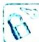

## 仿射变换的概念与性质

## 研究密钥

仿射变换是一种二维坐标到二维坐标的线性变换, 通俗来讲, 就是将一个空间内的图形按照一定的法则变换, 就会在另一个空间内得到与之对应的新图形. 变换保持二维图形间的相对位置关系不发生变化: 平行线还是平行线, 直线还是直线, 并且同一条直线上的点的位置顺序和长度的比例关系不变, 但向量的夹角可能会发生变化, 垂直关系可能会发生变化.

在进行仿射变换的过程中,需要清楚的是什么变了,什么没有变.在圆锥曲线中应用仿射变换,可实现化椭圆为圆,这样就可以借助圆中特有的一些性质解决问题,从而使问题的解决过程大大简化.

![[高中/总复习/专题/高考数学培优40讲/高考数学培优40讲-02-解析几何/第20讲_仿射变换/仿射变换的概念与性质/20_1_仿射变换的定义/20_1_仿射变换的定义.md]]
![[高中/总复习/专题/高考数学培优40讲/高考数学培优40讲-02-解析几何/第20讲_仿射变换/仿射变换的概念与性质/20_2_仿射变换的基本性质/20_2_仿射变换的基本性质.md]]
![[高中/总复习/专题/高考数学培优40讲/高考数学培优40讲-02-解析几何/第20讲_仿射变换/仿射变换的概念与性质/20_3_常用的仿射变换/20_3_常用的仿射变换.md]]
![[高中/总复习/专题/高考数学培优40讲/高考数学培优40讲-02-解析几何/第20讲_仿射变换/仿射变换的概念与性质/20_4_仿射变换性质应用/20_4_仿射变换性质应用.md]]
