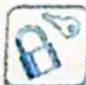

## 20.5 化椭圆为圆

## 研究密钥

圆有很多重要的几何性质,因此我们可以通过仿射变换将椭圆变成圆,再利用圆幂定理(相交弦定理、切割线定理、割线定理)等结论,就可以很好地处理与弦长、斜率、面积有关的一类问题.利用仿射变换的解法可大大降低解析几何的计算量,而且解题的思维更加流畅,更容易接近问题的本质.在日常的解析几何学习中,同学们应有意识地用不同的思想方法去探究解决数学问题,培养更自然的解题策略.

## 1. 妙解以求弦长为背景的解析几何问题

![[高中/总复习/专题/高考数学培优40讲/高考数学培优40讲-02-解析几何/第20讲_仿射变换/巧用仿射变换_椭圆问题圆中解/20_5_化椭圆为圆/例题/Q00019606.md]]
![[高中/总复习/专题/高考数学培优40讲/高考数学培优40讲-02-解析几何/第20讲_仿射变换/巧用仿射变换_椭圆问题圆中解/20_5_化椭圆为圆/例题/Q00019607.md]]
![[高中/总复习/专题/高考数学培优40讲/高考数学培优40讲-02-解析几何/第20讲_仿射变换/巧用仿射变换_椭圆问题圆中解/20_5_化椭圆为圆/例题/Q00019608.md]]
![[高中/总复习/专题/高考数学培优40讲/高考数学培优40讲-02-解析几何/第20讲_仿射变换/巧用仿射变换_椭圆问题圆中解/20_5_化椭圆为圆/例题/Q00019609.md]]
![[高中/总复习/专题/高考数学培优40讲/高考数学培优40讲-02-解析几何/第20讲_仿射变换/巧用仿射变换_椭圆问题圆中解/20_5_化椭圆为圆/例题/Q00019610.md]]
![[高中/总复习/专题/高考数学培优40讲/高考数学培优40讲-02-解析几何/第20讲_仿射变换/巧用仿射变换_椭圆问题圆中解/20_5_化椭圆为圆/例题/Q00019611.md]]
![[高中/总复习/专题/高考数学培优40讲/高考数学培优40讲-02-解析几何/第20讲_仿射变换/巧用仿射变换_椭圆问题圆中解/20_5_化椭圆为圆/例题/Q00019612.md]]
![[高中/总复习/专题/高考数学培优40讲/高考数学培优40讲-02-解析几何/第20讲_仿射变换/巧用仿射变换_椭圆问题圆中解/20_5_化椭圆为圆/例题/Q00019613.md]]
![[高中/总复习/专题/高考数学培优40讲/高考数学培优40讲-02-解析几何/第20讲_仿射变换/巧用仿射变换_椭圆问题圆中解/20_5_化椭圆为圆/例题/Q00019614.md]]
