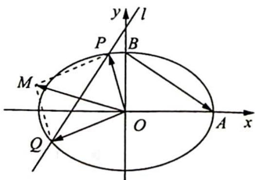

<!-- question-source:start -->
例 20.12 如图 1 所示, 在平面直角坐标系 $xOy$ 中, 经过点 $(0, \sqrt{2})$ 且斜率为 $k$ 的直线 $l$ 与椭圆 $\frac{x^2}{2} + y^2 = 1$ 有两个不同的交点 $P$ 和 $Q$ .

图1

(1) 求 k 的取值范围；

(2)设椭圆与 $x$ 轴的正半轴, $y$ 轴的正半轴的交点分别为 $A, B$ , 是否存在常数 $k$ , 使得向量 $\overrightarrow{OP} + \overrightarrow{OQ}$ 与 $\overrightarrow{AB}$ 共线? 如果存在, 求 $k$ 的值; 如果不存在, 请说明理由.
<!-- question-source:end -->

![[高中/总复习/专题/高考数学培优40讲/高考数学培优40讲-02-解析几何/第20讲_仿射变换/巧用仿射变换_椭圆问题圆中解/20_5_化椭圆为圆/例题/answers/Q00019608A1.md]]
