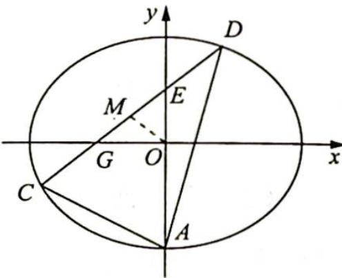

<!-- question-source:start -->
例 20.14 如图 1 所示, 设椭圆 $\frac{x^{2}}{a^{2}} + \frac{y^{2}}{4} = 1 (a > 2)$ 的离心率为 $\frac{\sqrt{3}}{3}$ , 斜率为 $k$ 的直线 $l$ 过点 $E(0,1)$ 且与椭圆交于 $C, D$ 两点.

(1) 求椭圆的方程；

(2) 若直线 l 与 x 轴交于点 G 且 $\overrightarrow{GC} = \overrightarrow{DE}$ ，求 k 的值；

(3)设点 $A$ 是椭圆的下顶点, $k_{AC}, k_{AD}$ 分别为直线 $AC, AD$ 的斜率, 求证: 对于任意的 $k$ , 恒有 $k_{AC} \cdot k_{AD} = -2$ .

图 1
<!-- question-source:end -->

![[高中/总复习/专题/高考数学培优40讲/高考数学培优40讲-02-解析几何/第20讲_仿射变换/巧用仿射变换_椭圆问题圆中解/20_5_化椭圆为圆/例题/answers/Q00019610A1.md]]
