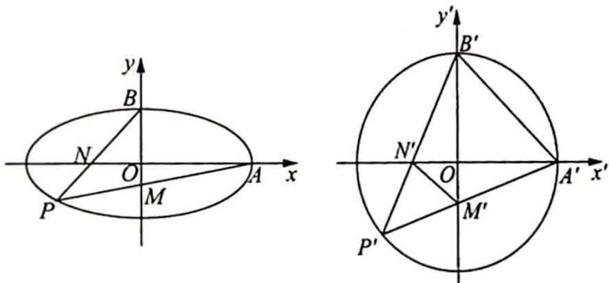

> [!faq]- 《高考数学培优40讲》例题解析
>
> > [!success]- **【答案】** 详见解析
>
> > [!note]- **【分析】**
> > 分析 ▶ 作仿射变换将椭圆变为圆, 证明 $|AN||BM|$ 为定值转化为证明 $|A'N'||B'M'|$ 为定值, 分析图形, 通过角度可以证明 $\triangle A'B'N'\sim\triangle B'M'A'$ , 通过对应边成比例得出 $|A'N'||B'M'|$ 为定值, 即可得 $|AN||BM|$ 为定值.
>
> > [!note]- **【解析】**
> > 解析 (1)由已知条件可得 $\frac{c}{a} = \frac{\sqrt{3}}{2}, \frac{1}{2} ab = 1$ ，又因为 $a^2 = b^2 + c^2$ ，解得 $\left\{ \begin{array}{l} a = 2 \\ b = 1 \\ c = \sqrt{3} \end{array} \right.$ ，所以椭圆 $C$ 的方程为 $\frac{x^2}{4} + y^2 = 1$ .
> > (2)如图所示,在仿射变换 $\left\{\begin{aligned}x^{\prime}&=x\\ y^{\prime}&=2y\end{aligned}\right.$ 下,椭圆C变为圆 $C^{\prime}:x^{\prime2}+y^{\prime2}=4$ .
> > 设点A,B,P,M,N变换后对应的点分别为 $A^{\prime},B^{\prime},P^{\prime},M^{\prime},N^{\prime}$ ,连接 $A^{\prime}B^{\prime},M^{\prime}N^{\prime}$ ,则由于 $\left\{\begin{aligned}\angle A^{\prime}B^{\prime}N^{\prime}&=\angle OB^{\prime}N^{\prime}+45^{\circ}=\angle OB^{\prime}N^{\prime}+\angle P^{\prime}=\angle A^{\prime}M^{\prime}B^{\prime}\\ \angle B^{\prime}A^{\prime}N^{\prime}&=\angle A^{\prime}B^{\prime}M^{\prime}=45^{\circ}\end{aligned}\right.$ ,所以 $\triangle A^{\prime}B^{\prime}N^{\prime}\sim\triangle B^{\prime}M^{\prime}A^{\prime}$ , $\frac{|A^{\prime}N^{\prime}|}{|B^{\prime}A^{\prime}|}=\frac{|A^{\prime}B^{\prime}|}{|B^{\prime}M^{\prime}|}$ ,即 $|A^{\prime}N^{\prime}||B^{\prime}M^{\prime}|=|A^{\prime}B^{\prime}|^{2},|AN|\cdot2|BM|=8$ ,即 $|AN||BM|=4$ ,为定值.
> > 
