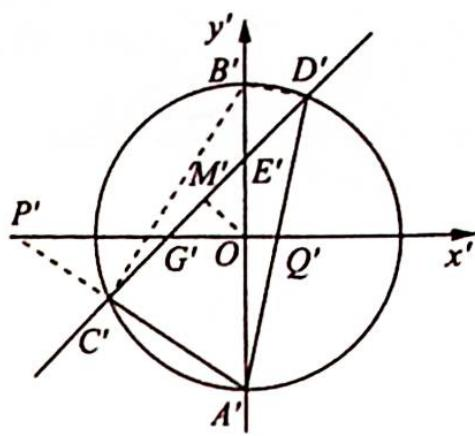

> [!faq]- 《高考数学培优40讲》例题解析
>
> > [!success]- **【答案】** 详见解析
>
> > [!note]- **【分析】**
> > 分析 ▶ (1)待定系数法求基本量; (2)作仿射变换将椭圆变为圆, 求直线 $l$ 的斜率转化为求圆中 $C^{\prime}D^{\prime}$ 的斜率; (3)要证 $k_{AC} \cdot k_{AD} = -2$ , 即证 $k_{A^{\prime}C^{\prime}} \cdot k_{A^{\prime}D^{\prime}} = -3$ , 此等式可通过转化为 $\triangle C^{\prime}A^{\prime}D^{\prime}$ 与 $\triangle C^{\prime}B^{\prime}D^{\prime}$ 的面积比为 3 来证明.
>
> > [!note]- **【解析】**
> > 解析 (1)根据 $\left\{ \begin{array}{l} \frac{c}{a} = \frac{\sqrt{3}}{3} \\ a^2 - 4 = c^2 \end{array} \right.$ , 易得椭圆的方程为 $\frac{x^2}{6} + \frac{y^2}{4} = 1$ .
> > (2)如图2所示,把xOy平面上所有点的横坐标变为原来的 $\frac{\sqrt{6}}{3}$ ,纵坐标不变,即作仿射变换 $\left\{\begin{aligned}x^{\prime}&=\frac{\sqrt{6}}{3}x\\ y^{\prime}&=y\end{aligned}\right.$ ，得到 $x'Oy'$ 平面，则椭圆 $\frac{x^{2}}{6}+\frac{y^{2}}{4}=1$ 变成圆 $x^{\prime2}+y^{\prime2}=4$ ，任意一条直线的斜率变为原来的 $\frac{3}{\sqrt{6}}$ 倍.
> > 如图1所示,取GE的中点M,连接OM,因为 $\overrightarrow{GC}=\overrightarrow{DE}$ ,所以点M平分弦CD,将点线位置关系对应到图2中, 有点 $M'$ 平分弦 $C'D'$ , $OM'$ 垂直平分弦 $C'D'$ , 又 $\overrightarrow{G'C'} = \overrightarrow{D'E'}$ , 所以 $OM'$ 垂直平分线段 $G'E'$ , 则在 Rt $\triangle E'OG'$ 中, $\triangle OM'G'$ 是等腰直角三角形, 所以 $\angle M'G'O = \angle M'OG' = 45^\circ$ , $k_{C'D'} = \tan 45^\circ = 1$ .
> > 
> > 根据对称性可知直线 $l'$ 的斜率为 $k' = \pm 1$ , 所以直线 $l$ 的斜率为 $k = \frac{\sqrt{6}}{3} k' = \pm \frac{\sqrt{6}}{3}$ .
> > 图 2
> > (3)根据仿射变换的性质可知 $k_{AC} \cdot k_{AD} = -2 \Leftrightarrow k_{A'C'} \cdot k_{A'D'} = \frac{3}{\sqrt{6}} k_{AC} \cdot \frac{3}{\sqrt{6}} k_{AD} = -3.$
> > 设圆与 $y'$ 轴的交点为 $B'$ , 连接 $B'C', B'D'$ , 延长 $A'C'$ 交 $x'$ 轴于点 $P'$ , 设 $A'D'$ 交 $x'$ 轴于点 $Q'$ , 则 $k_{A'C'} = -\tan \angle A' P'O = -\tan \angle A'B'C' = -\frac{|A'C'|}{|B'C'|}, k_{A'D'} = \tan \angle A' Q'O = \tan \angle A'B'D' = \frac{|A'D'|}{|B'D'|}$ , 所以 $k_{A'C'} \cdot k_{A'D'} = -3 \Leftrightarrow \frac{|A'C'|}{|B'C'|} \cdot \frac{|A'D'|}{|B'D'|} = 3 \Leftrightarrow \frac{\frac{1}{2}|A'C'||A'D'|\sin \angle C'A'D'}{\frac{1}{2}|B'C'||B'D'|\sin \angle C'B'D'} = 3 \Leftrightarrow \frac{S_{\triangle C'A'D'}}{S_{\triangle C'B'D'}} = 3 \Leftrightarrow \frac{|A'E'|}{|B'E'|} = 3.$ 而 $\frac{|A'E'|}{|B'E'|} = 3$ 显然成立, 所以对于任意的 $k$ , 恒有 $k_{AC} \cdot k_{AD} = -2$ .
> > ## 3. 妙解以求面积最值为背景的解析几何题目
