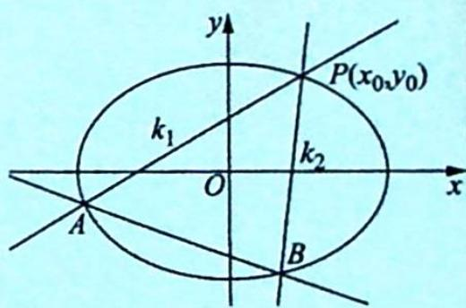

## 21.1.1 斜率之积为定值

## 研究密钥

如图所示, 若 $P(x_0, y_0)$ 为椭圆 $C: \frac{x^2}{a^2} + \frac{y^2}{b^2} = 1 (a > b > 0)$ 上一点, 过 $P$ 作斜率为 $k_1, k_2$ 的两条直线分别与椭圆交于 $A, B$ 两点, 若 $k_1 k_2 = \lambda (\lambda \neq \frac{b^2}{a^2})$ , 则直线 $AB$ 过定点 $M \left( \frac{\lambda a^2 + b^2}{\lambda a^2 - b^2} x_0, -\frac{\lambda a^2 + b^2}{\lambda a^2 - b^2} y_0 \right)$ .

【证明】(1)当直线 $AB$ 的斜率不存在时, 设 $A(x,y), B(x,-y)$ , 则 $k_{1}k_{2}=\frac{y-y_{0}}{x-x_{0}}\cdot\frac{-y-y_{0}}{x-x_{0}}=\frac{y_{0}^{2}-y^{2}}{(x-x_{0})^{2}}=\frac{b^{2}\left(1-\frac{x_{0}^{2}}{a^{2}}\right)-b^{2}\left(1-\frac{x^{2}}{a^{2}}\right)}{(x-x_{0})^{2}}=\frac{b^{2}(x+x_{0})}{a^{2}(x-x_{0})}=\lambda$ , 解得 $x=\frac{\lambda a^{2}+b^{2}}{\lambda a^{2}-b^{2}}x_{0}$ , 所以直线 $AB$ 过定点 $M\left(\frac{\lambda a^{2}+b^{2}}{\lambda a^{2}-b^{2}}x_{0}, -\frac{\lambda a^{2}+b^{2}}{\lambda a^{2}-b^{2}}y_{0}\right)$ .

(2)当直线 ${AB}$ 的斜率存在时,将坐标原点平移至点 $P\left( {{x}_{0},{y}_{0}}\right)$ ,则曲线方程变为 $\frac{{\left( x + {x}_{0}\right) }^{2}}{{a}^{2}} +$ $\frac{{\left( y + {y}_{0}\right) }^{2}}{{b}^{2}} = 1.$

在新坐标系下, 设直线 $AB: y = kx + m$ , 当 $m \neq 0$ 时, 则有 $\frac{y - kx}{m} = 1$ , 所以 $A, B$ 两点的坐标满足 $b^2 x^2 + a^2 y^2 + 2b^2 x_0 x \cdot \frac{y - kx}{m} + 2a^2 y_0 y \cdot \frac{y - kx}{m} = 0$ , 化简得 $a^2 (m + 2y_0)y^2 + (2b^2 x_0 - 2a^2 y_0 k)xy + b^2 (m - 2kx_0)x^2 = 0$ (※).

当 $m = 0$ 时，方程（※）也成立，在方程（※）两边同时除以 $x^{2}$ ，得 $a^2 (m + 2y_0)\left(\frac{y}{x}\right)^2 + (2b^2 x_0 - 2a^2 y_0k)\left(\frac{y}{x}\right) + b^2 (m - 2kx_0) = 0$ ，所以 $k_{1}k_{2} = \frac{b^{2}(m - 2kx_{0})}{a^{2}(m + 2y_{0})} = \lambda (\lambda \neq \frac{b^{2}}{a^{2}})$ ，即 $b^{2}(m - 2kx_{0}) = \lambda a^{2}(m + 2y_{0})$ ，解得 $m = -\frac{2b^2x_0}{\lambda a^2 - b^2} k - \frac{2\lambda a^2y_0}{\lambda a^2 - b^2}$ .

所以直线 $AB$ 的方程为 $y = kx + m = k\left(x - \frac{2b^2x_0}{\lambda a^2 - b^2}\right) - \frac{2\lambda a^2y_0}{\lambda a^2 - b^2}$ , 过定点 $M\left(\frac{2b^2x_0}{\lambda a^2 - b^2}, -\frac{2\lambda a^2y_0}{\lambda a^2 - b^2}\right)$ .

故直线 AB 在原坐标系下过定点 $M\left(\frac{\lambda a^{2}+b^{2}}{\lambda a^{2}-b^{2}}x_{0},-\frac{\lambda a^{2}+b^{2}}{\lambda a^{2}-b^{2}}y_{0}\right)$ .

特殊情况：

(1)当 $\lambda = -1$ 时, 即 $PA \perp PB$ , 直线 $AB$ 过定点 $\left(\frac{a^2 - b^2}{a^2 + b^2} x_0, \frac{b^2 - a^2}{a^2 + b^2} y_0\right)$ , 此结论在 2020 新高考全国卷的压轴题中考查过.

(2)当 $P$ 点位于特殊位置, 即椭圆的顶点时, 设 $P(a,0), k_1k_2 = \lambda (\lambda \neq \frac{b^2}{a^2})$ , 则直线 $AB$ 过定点 $\left(\frac{a^2\lambda + b^2}{a^2\lambda - b^2} a, 0\right)$ , 此结论在 2020 新课标全国 I 卷理科试卷的 20 题中考查过.

(3) 当 $\lambda = -1$ 时, 且 $P(a,0)$ (右顶点) 时, 直线 $AB$ 过定点 $\left(\frac{a^2 - b^2}{a^2 + b^2} a,0\right)$ .

## 1. 斜率之积为 -1

![[高中/总复习/专题/高考数学培优40讲/高考数学培优40讲-02-解析几何/第21讲_圆锥曲线中常考六大模型及延伸/21_1_直线定向或过定点模型及延伸/21_1_1_斜率之积为定值/例题/Q00019626.md]]
![[高中/总复习/专题/高考数学培优40讲/高考数学培优40讲-02-解析几何/第21讲_圆锥曲线中常考六大模型及延伸/21_1_直线定向或过定点模型及延伸/21_1_1_斜率之积为定值/例题/Q00019627.md]]
![[高中/总复习/专题/高考数学培优40讲/高考数学培优40讲-02-解析几何/第21讲_圆锥曲线中常考六大模型及延伸/21_1_直线定向或过定点模型及延伸/21_1_1_斜率之积为定值/例题/Q00019628.md]]
![[高中/总复习/专题/高考数学培优40讲/高考数学培优40讲-02-解析几何/第21讲_圆锥曲线中常考六大模型及延伸/21_1_直线定向或过定点模型及延伸/21_1_1_斜率之积为定值/例题/Q00019629.md]]
![[高中/总复习/专题/高考数学培优40讲/高考数学培优40讲-02-解析几何/第21讲_圆锥曲线中常考六大模型及延伸/21_1_直线定向或过定点模型及延伸/21_1_1_斜率之积为定值/例题/Q00019630.md]]
![[高中/总复习/专题/高考数学培优40讲/高考数学培优40讲-02-解析几何/第21讲_圆锥曲线中常考六大模型及延伸/21_1_直线定向或过定点模型及延伸/21_1_1_斜率之积为定值/例题/Q00019631.md]]
