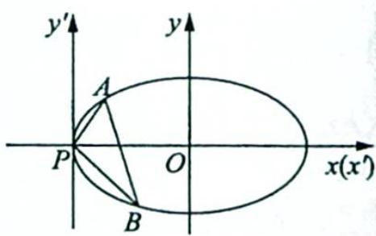

> [!faq]- 《高考数学培优40讲》例题解析
>
> > [!success]- **【答案】** 详见解析
>
> > [!note]- **【分析】**
> > 分析 ▶ (1)由题意可得 $c = \sqrt{3}$ , 根据椭圆的定义可得 $a = 2$ , 由 $b^{2} = a^{2} - c^{2}$ 可得 $b = 1$ ; (2)思路一(代数法): 设直线方程 $y = kx + m$ , 将直线方程与椭圆方程联立, 根据韦达定理可得 $x_{1} + x_{2}, x_{1}x_{2}$ , 代入 $\overrightarrow{AP} \cdot \overrightarrow{AQ} = 0$ 求出 $m$ 与 $k$ 的关系式得到定点. 思路二(坐标平移齐次化): $\overrightarrow{AP} \cdot$ $\overrightarrow{AQ}=0$ , 即 $k_{AP} \cdot k_{AQ} = -1$ , 两直线斜率之积为定值, 故可以用坐标平移齐次化处理. 当然也可以根据对称性及模型结论, 先猜后证.
>
> > [!note]- **【解析】**
> > 解析 (1) 因为 $|F_{1} F_{2}| = 2 \sqrt{3}$ , $|MF_{1}| + |MF_{2}| = 4 > 2 \sqrt{3}$ , 所以动点 $M$ 的轨迹是以 $F_{1}(-\sqrt{3},0)$ , $F_{2}(\sqrt{3},0)$ 为焦点, 以 4 为长轴长的椭圆, 即 $2a = 4, 2c = 2\sqrt{3}$ , 故 $a = 2, c = \sqrt{3}, b^{2} = a^{2} - c^{2} = 1$ .
> > 所以曲线 C 的方程为 $\frac{x^{2}}{4} + y^{2} = 1$ .
> > (2)解法一(代数法):①当直线 $l \perp x$ 轴时,设 $P(x_0, y_0)(x_0 \in (-2, 2])$ , $Q(x_0, -y_0)$ .
> > 又因为点 $A(-2,0)$ , 则 $\overrightarrow{AP} = (x_0 + 2, y_0), \overrightarrow{AQ} = (x_0 + 2, -y_0)$ , 由 $\overrightarrow{AP} \cdot \overrightarrow{AQ} = 0$ 可得 $(x_0 + 2)^2 - y_0^2 = 0$ .
> > 联立 $\left\{\begin{aligned}(x_{0}+2)^{2}-y_{0}^{2}&=0\\ \frac{x_{0}^{2}}{4}+y_{0}^{2}&=1\end{aligned}\right.$ ，消去 $y_{0}$ 并整理得， $5x_{0}^{2}+16x_{0}+12=0$ ，解得 $x_{0}=-\frac{6}{5}$ 或 $x_{0}=-2$ （舍去）.
> > 此时直线 $l: x = -\frac{6}{5}$ ，由题意及椭圆的对称性可知，定点在 x 轴上，故定点为 $\left(-\frac{6}{5}, 0\right)$ .
> > - **②**：下面证明在一般情形下, 直线 l 都过定点 $\left(-\frac{6}{5},0\right)$ .
> > 当直线 l 不与 x 轴垂直时，设直线方程为 $l: y = kx + m$ ，并设点 $P(x_{1}, y_{1}), Q(x_{2}, y_{2})$ ，联立方程 $\left\{\begin{aligned}\frac{x^{2}}{4} + y^{2} &= 1 \\ y &= kx + m\end{aligned}\right.$ ，消去 y 整理得 $(4k^{2} + 1)x^{2} + 8kmx + 4m^{2} - 4 = 0$ .
> > 则有 $\Delta = (8km)^2 - 4(4k^2 + 1)(4m^2 - 4) > 0$ ，即 $m^2 < 4k^2 + 1$ ，且 $x_1 + x_2 = \frac{-8km}{4k^2 + 1}, x_1x_2 = \frac{4m^2 - 4}{4k^2 + 1}$ .
> > 因为 $\overrightarrow{AP} \cdot \overrightarrow{AQ} = 0$ ，且 $A$ 为左顶点，所以 $(x_{1} + 2, y_{1}) \cdot (x_{2} + 2, y_{2}) = 0$ ，即 $x_{1}x_{2} + 2(x_{1} + x_{2}) + 4 + y_{1}y_{2} = 0$ ，亦即 $x_{1}x_{2} + 2(x_{1} + x_{2}) + 4 + (kx_{1} + m)(kx_{2} + m) = 0$ ，整理得 $(k^{2} + 1)x_{1}x_{2} + (km + 2)(x_{1} + x_{2}) + m^{2} + 4 = 0$ ①.
> > 将 $x_{1}+x_{2}, x_{1}x_{2}$ 代入式①，化简得 $5m^{2}-16km+12k^{2}=0$ ，解得 m=2k 或 $m=\frac{6k}{5}$ .
> > (i) 当 $m = {2k}$ 时, $l : y = {kx} + {2k} = k\left( {x + 2}\right)$ 过左顶点(-2,0),与题意不符,故舍去.
> > (ii) 当 $m = \frac{6k}{5}$ 时, $l: y = kx + \frac{6k}{5} = k\left(x + \frac{6}{5}\right)$ 过定点 $\left(-\frac{6}{5}, 0\right)$ , 且满足 $m^2 < 4k^2 + 1$ , 符合题意, 所以 $m = \frac{6k}{5}$ , 直线 $l$ 过定点 $\left(-\frac{6}{5}, 0\right)$ .
> > 综上所述，当 $\overrightarrow{AP}\cdot\overrightarrow{AQ}=0$ 时，直线l过定点，其坐标为 $\left(-\frac{6}{5},0\right)$ .
> > 解法二（坐标平移齐次化）：直接套用模型：若 $k_{1}k_{2} = \lambda \left(\lambda \neq \frac{b^{2}}{a^{2}}\right)$ ，直线过定点 $\left(\frac{\lambda a^2 + b^2}{\lambda a^2 - b^2} x_0, -\frac{\lambda a^2 + b^2}{\lambda a^2 - b^2} y_0\right)$ .
> > 因为 $k_{AP} \cdot k_{AQ} = -1, A(-2,0)$ ，所以把 $\lambda = -1, x_{0} = -a = -2, y_{0} = 0$ 代入，可得定点 $\left(-\frac{6}{5}, 0\right)$ .
> > 证明如下：
> > 将原坐标系的原点 O 平移至点 A(-2,0)，则 $\left\{\begin{aligned}x&=x^{\prime}-2\\ y&=y^{\prime}\end{aligned}\right.$ ，在新坐标系下椭圆方程为 $\frac{(x^{\prime}-2)^{2}}{4}+y^{\prime2}=1$ ，即 $x^{\prime2}+4y^{\prime2}-4x^{\prime}=0$ 。
> > 设直线 l 的方程为 $mx' + ny' = 1$ ，代入椭圆方程得 $x'^{2} + 4y'^{2} - 4x'(mx' + ny') = 0$ ，即 $(1 - 4m)x'^{2} + 4y'^{2} - 4nx'y' = 0$ ，两边同时除以 $x'^{2}$ ，可得 $4\left(\frac{y'}{x'}\right)^{2} - 4n\frac{y'}{x'} + (1 - 4m) = 0$ ，因为 $\overrightarrow{AP} \cdot \overrightarrow{AQ} = 0$ ，所以 $k_{AP} \cdot k_{AQ} = \frac{1 - 4m}{4} = -1$ ，解得 $m = \frac{5}{4}$ ，所以直线 l 在新坐标系下过定点 $\left(\frac{4}{5}, 0\right)$ ，则直线 l 在原坐标系下过定点 $\left(-\frac{6}{5}, 0\right)$ 。
> > 探究总结
> > ## 椭圆内接直角三角形的直角顶点在椭圆的顶点时,斜边过定点
> > 通过上述模型,我们可得一个结论:
> > 椭圆 $C: \frac{x^2}{a^2} + \frac{y^2}{b^2} = 1 (a > b > 0)$ 有内接直角三角形, 若直角顶点在椭圆的左顶点 $(-a, 0)$ 时, 则斜边所在的直线过定点 $\left(\frac{-a(a^2 - b^2)}{a^2 + b^2}, 0\right)$ .
> > 证明:如图所示,设 $A(x_{1},y_{1})$ , $B(x_{2},y_{2})$ , 将原坐标系的原点 O 平移至点 P, 则任意一点的原坐标 $(x,y)$ 与新坐标 $(x',y')$ 的关系为 $\left\{\begin{aligned} x &= x' - a \\ y &= y'\end{aligned}\right.$ ，故椭圆在新坐标系中的方程为 $\frac{(x'-a)^{2}}{a^{2}} + \frac{y'^{2}}{b^{2}} = 1$ ，所以椭圆的方程可化为 $\frac{x'^{2}}{a^{2}} + \frac{y'^{2}}{b^{2}} - \frac{2}{a}x' = 0$ .
> > 
> > 设直线 $AB$ 在新坐标系中的方程为 $mx' + ny' = 1$ , 将直线 $AB$ 的方程代入椭圆的方程齐次化得 $\frac{x^{'2}}{a^{2}}+\frac{y^{'2}}{b^{2}}-\frac{2}{a}x^{'}(mx^{'+ny^{'})=0$ ，展开得 $\frac{y^{'2}}{b^{2}}-\frac{2n}{a}y^{'x^{'}}+\frac{1-2am}{a^{2}}x^{'2}=0$ ，左、右两边同时除以 $x^{'2}$ ，得 $\frac{1}{b^{2}}\left(\frac{y^{'}}{x^{'}}\right)^{2}-\frac{2n}{a}\left(\frac{y^{'}}{x^{'}}\right)+\frac{1-2am}{a^{2}}=0$ 。
> > 而上述方程的两根即为直线 $PA, PB$ 的斜率, 所以由根与系数的关系得 $k_{PA} \cdot k_{PB} = \frac{y_1'}{x_1'} \cdot \frac{y_2'}{x_2'} = \frac{b^2(1 - 2am)}{a^2}$ .
> > 若 $PA \perp PB$ , 则 $k_{PA} \cdot k_{PB} = \frac{b^2(1 - 2am)}{a^2} = -1$ , 即 $\frac{2b^2a}{a^2 + b^2} m = 1$ , 所以直线 $AB$ 在新坐标系中过定点 $\left(\frac{2b^2a}{a^2 + b^2}, 0\right)$ , 直线 $AB$ 在原坐标系中过定点 $\left(\frac{2b^2a}{a^2 + b^2} - a, 0\right)$ , 即过定点 $\left(\frac{-a(a^2 - b^2)}{a^2 + b^2}, 0\right)$ .
> > 同理,不难证明以下结论都是正确的:
> > 若直角顶点在椭圆的右顶点 $(a,0)$ 时，则斜边所在的直线过定点 $\left(\frac{a\left(a^{2}-b^{2}\right)}{a^{2}+b^{2}},0\right)$ ;
> > 若直角顶点在椭圆的上顶点(0,b)时,则斜边所在的直线过定点 $\left(0,\frac{-b(a^{2}-b^{2})}{a^{2}+b^{2}}\right)$ ;
> > 若直角顶点在椭圆的下顶点 $(0,-b)$ 时,则斜边所在的直线过定点 $\left(0,\frac{(a^{2}-b^{2})b}{a^{2}+b^{2}}\right)$ .
